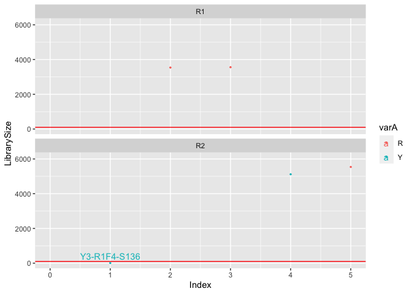

```bash
ls -lh  test-data/* 
```

```
## -rw-r--r--  1 fconstan  staff   8.9K Jan 11 13:54 test-data/metadata.xlsx
## 
## test-data/180914_M00842_0310_000000000-C3GBT:
## total 42120
## -rwxr-xr-x  1 fconstan  staff   2.4M Jan 11 13:54 R1F1-S66_L001_R1_001.fastq.gz
## -rwxr-xr-x  1 fconstan  staff   3.5M Jan 11 13:54 R1F1-S66_L001_R2_001.fastq.gz
## -rwxr-xr-x  1 fconstan  staff   2.1M Jan 11 13:54 R1F2-S300_L001_R1_001.fastq.gz
## -rwxr-xr-x  1 fconstan  staff   2.9M Jan 11 13:54 R1F2-S300_L001_R2_001.fastq.gz
## -rwxr-xr-x  1 fconstan  staff   4.1M Jan 11 13:54 R1F3-S90_L001_R1_001.fastq.gz
## -rwxr-xr-x  1 fconstan  staff   5.5M Jan 11 13:54 R1F3-S90_L001_R2_001.fastq.gz
## 
## test-data/190719_M00842_0364_000000000-CKGHM:
## total 36632
## -rw-r--r--  1 fconstan  staff   3.8M Jan 11 13:54 Y2A15-2M-06-S78_L001_R1_001.fastq.gz
## -rw-r--r--  1 fconstan  staff   4.0M Jan 11 13:54 Y2A15-2M-06-S78_L001_R2_001.fastq.gz
## -rw-r--r--  1 fconstan  staff   4.8M Jan 11 13:54 Y2A15-2M-12-S77_L001_R1_001.fastq.gz
## -rw-r--r--  1 fconstan  staff   5.2M Jan 11 13:54 Y2A15-2M-12-S77_L001_R2_001.fastq.gz
## -rw-r--r--  1 fconstan  staff    12K Jan 11 13:54 Y3-R1F4-S136_L001_R1_001.fastq.gz
## -rw-r--r--  1 fconstan  staff    14K Jan 11 13:54 Y3-R1F4-S136_L001_R2_001.fastq.gz
```

# Activate the dedicated conda environment:

```bash
conda activate metabarcodingRpipeline
```


# Run the pipeline step by step:

## Check presence of primers in Fwd and Rev reads - optional:


```bash
Rscript scripts/run_check_primers.Rscript \
-i test-data \
--n_samples 1 \
--fwd_primer CCTAYGGGRBGCASCAG \
--rev_primer GGACTACNNGGGTATCTAAT \
-f scripts/functions_export_simplified.R \
--export rscript-output/
```

```
## 
## ############################################################
## Starting 
## ############################################################
## 
## Loading required package: optparse
## 
## # Input directory: test-data.
## 
## # Fwd Primer sequence: CCTAYGGGRBGCASCAG.
## 
## # Rev Primer sequence: GGACTACNNGGGTATCTAAT.
## 
## # Number of samples: 1.
## 
## # output will be exported in : rscript-output/.
## Loading required package: tidyverse
## ── Attaching packages ────────────────────────────────── tidyverse 1.3.0.9000 ──
## ✓ ggplot2 3.3.3     ✓ purrr   0.3.4
## ✓ tibble  3.1.0     ✓ dplyr   1.0.4
## ✓ tidyr   1.1.2     ✓ stringr 1.4.0
## ✓ readr   1.4.0     ✓ forcats 0.5.1
## ── Conflicts ────────────────────────────────────────── tidyverse_conflicts() ──
## x dplyr::filter() masks stats::filter()
## x dplyr::lag()    masks stats::lag()
## Loading required package: dada2
## Loading required package: Rcpp
## Loading required package: ShortRead
## Loading required package: BiocGenerics
## Loading required package: parallel
## 
## Attaching package: ‘BiocGenerics’
## 
## The following objects are masked from ‘package:parallel’:
## 
##     clusterApply, clusterApplyLB, clusterCall, clusterEvalQ,
##     clusterExport, clusterMap, parApply, parCapply, parLapply,
##     parLapplyLB, parRapply, parSapply, parSapplyLB
## 
## The following objects are masked from ‘package:dplyr’:
## 
##     combine, intersect, setdiff, union
## 
## The following objects are masked from ‘package:stats’:
## 
##     IQR, mad, sd, var, xtabs
## 
## The following objects are masked from ‘package:base’:
## 
##     anyDuplicated, append, as.data.frame, basename, cbind, colnames,
##     dirname, do.call, duplicated, eval, evalq, Filter, Find, get, grep,
##     grepl, intersect, is.unsorted, lapply, Map, mapply, match, mget,
##     order, paste, pmax, pmax.int, pmin, pmin.int, Position, rank,
##     rbind, Reduce, rownames, sapply, setdiff, sort, table, tapply,
##     union, unique, unsplit, which.max, which.min
## 
## Loading required package: BiocParallel
## Loading required package: Biostrings
## Loading required package: S4Vectors
## Loading required package: stats4
## 
## Attaching package: ‘S4Vectors’
## 
## The following objects are masked from ‘package:dplyr’:
## 
##     first, rename
## 
## The following object is masked from ‘package:tidyr’:
## 
##     expand
## 
## The following object is masked from ‘package:base’:
## 
##     expand.grid
## 
## Loading required package: IRanges
## 
## Attaching package: ‘IRanges’
## 
## The following objects are masked from ‘package:dplyr’:
## 
##     collapse, desc, slice
## 
## The following object is masked from ‘package:purrr’:
## 
##     reduce
## 
## Loading required package: XVector
## 
## Attaching package: ‘XVector’
## 
## The following object is masked from ‘package:purrr’:
## 
##     compact
## 
## 
## Attaching package: ‘Biostrings’
## 
## The following object is masked from ‘package:base’:
## 
##     strsplit
## 
## Loading required package: Rsamtools
## Loading required package: GenomeInfoDb
## Loading required package: GenomicRanges
## Loading required package: GenomicAlignments
## Loading required package: SummarizedExperiment
## Loading required package: MatrixGenerics
## Loading required package: matrixStats
## 
## Attaching package: ‘matrixStats’
## 
## The following object is masked from ‘package:dplyr’:
## 
##     count
## 
## 
## Attaching package: ‘MatrixGenerics’
## 
## The following objects are masked from ‘package:matrixStats’:
## 
##     colAlls, colAnyNAs, colAnys, colAvgsPerRowSet, colCollapse,
##     colCounts, colCummaxs, colCummins, colCumprods, colCumsums,
##     colDiffs, colIQRDiffs, colIQRs, colLogSumExps, colMadDiffs,
##     colMads, colMaxs, colMeans2, colMedians, colMins, colOrderStats,
##     colProds, colQuantiles, colRanges, colRanks, colSdDiffs, colSds,
##     colSums2, colTabulates, colVarDiffs, colVars, colWeightedMads,
##     colWeightedMeans, colWeightedMedians, colWeightedSds,
##     colWeightedVars, rowAlls, rowAnyNAs, rowAnys, rowAvgsPerColSet,
##     rowCollapse, rowCounts, rowCummaxs, rowCummins, rowCumprods,
##     rowCumsums, rowDiffs, rowIQRDiffs, rowIQRs, rowLogSumExps,
##     rowMadDiffs, rowMads, rowMaxs, rowMeans2, rowMedians, rowMins,
##     rowOrderStats, rowProds, rowQuantiles, rowRanges, rowRanks,
##     rowSdDiffs, rowSds, rowSums2, rowTabulates, rowVarDiffs, rowVars,
##     rowWeightedMads, rowWeightedMeans, rowWeightedMedians,
##     rowWeightedSds, rowWeightedVars
## 
## Loading required package: Biobase
## Welcome to Bioconductor
## 
##     Vignettes contain introductory material; view with
##     'browseVignettes()'. To cite Bioconductor, see
##     'citation("Biobase")', and for packages 'citation("pkgname")'.
## 
## 
## Attaching package: ‘Biobase’
## 
## The following object is masked from ‘package:MatrixGenerics’:
## 
##     rowMedians
## 
## The following objects are masked from ‘package:matrixStats’:
## 
##     anyMissing, rowMedians
## 
## 
## Attaching package: ‘GenomicAlignments’
## 
## The following object is masked from ‘package:dplyr’:
## 
##     last
## 
## 
## Attaching package: ‘ShortRead’
## 
## The following object is masked from ‘package:dplyr’:
## 
##     id
## 
## The following object is masked from ‘package:purrr’:
## 
##     compose
## 
## The following object is masked from ‘package:tibble’:
## 
##     view
## 
## 
## ##You are using DADA2 version 1.16.0
## 
## ##You are using tidyverse version 1.3.0.9000
## 
## 
## ##You are using ShortRead version 1.46.0
## 
## 
## ##You are using Biostrings version 2.58.0
## 
## ################################
## 
## 
## # sample names list starts with : 
## # sample names list starts with : $`180914_M00842_0310_000000000-C3GBT`
##                  Forward Complement Reverse RevComp
## FWD.ForwardReads    2055        915     915     915
## FWD.ReverseReads     943        943     943    1129
## REV.ForwardReads     915        915     915    1950
## REV.ReverseReads    5918        943     943     943
## 
## $`190719_M00842_0364_000000000-CKGHM`
##                  Forward Complement Reverse RevComp
## FWD.ForwardReads    3498          5       5       5
## FWD.ReverseReads       0          0       0      16
## REV.ForwardReads      13          4       5     422
## REV.ReverseReads    3971          0       0       2
## 
## Warning message:
## In dir.create(export, recursive = TRUE) : 'rscript-output' already exists
## 
## 
## Here some Info for the record keeping:
## 
## R version 4.0.4 (2021-02-15)
## Platform: x86_64-apple-darwin17.0 (64-bit)
## Running under: macOS Mojave 10.14.6
## 
## Matrix products: default
## BLAS:   /Library/Frameworks/R.framework/Versions/4.0/Resources/lib/libRblas.dylib
## LAPACK: /Library/Frameworks/R.framework/Versions/4.0/Resources/lib/libRlapack.dylib
## 
## locale:
## [1] en_US.UTF-8/en_US.UTF-8/en_US.UTF-8/C/en_US.UTF-8/en_US.UTF-8
## 
## attached base packages:
## [1] stats4    parallel  stats     graphics  grDevices utils     datasets 
## [8] methods   base     
## 
## other attached packages:
##  [1] ShortRead_1.46.0            GenomicAlignments_1.24.0   
##  [3] SummarizedExperiment_1.20.0 Biobase_2.50.0             
##  [5] MatrixGenerics_1.2.0        matrixStats_0.58.0         
##  [7] Rsamtools_2.4.0             GenomicRanges_1.42.0       
##  [9] GenomeInfoDb_1.26.2         Biostrings_2.58.0          
## [11] XVector_0.30.0              IRanges_2.24.1             
## [13] S4Vectors_0.28.1            BiocParallel_1.24.1        
## [15] BiocGenerics_0.36.0         dada2_1.16.0               
## [17] Rcpp_1.0.6                  forcats_0.5.1              
## [19] stringr_1.4.0               dplyr_1.0.4                
## [21] purrr_0.3.4                 readr_1.4.0                
## [23] tidyr_1.1.2                 tibble_3.1.0               
## [25] ggplot2_3.3.3               tidyverse_1.3.0.9000       
## [27] optparse_1.6.6             
## 
## loaded via a namespace (and not attached):
##  [1] httr_1.4.2             jsonlite_1.7.2         modelr_0.1.8          
##  [4] RcppParallel_5.0.3     assertthat_0.2.1       latticeExtra_0.6-29   
##  [7] GenomeInfoDbData_1.2.4 cellranger_1.1.0       pillar_1.5.0          
## [10] backports_1.2.1        lattice_0.20-41        glue_1.4.2            
## [13] RColorBrewer_1.1-2     rvest_0.3.6            colorspace_2.0-0      
## [16] plyr_1.8.6             Matrix_1.3-2           pkgconfig_2.0.3       
## [19] broom_0.7.5            haven_2.3.1            zlibbioc_1.36.0       
## [22] scales_1.1.1           jpeg_0.1-8.1           getopt_1.20.3         
## [25] generics_0.1.0         ellipsis_0.3.1         withr_2.4.1           
## [28] cli_2.3.1              magrittr_2.0.1         crayon_1.4.1          
## [31] readxl_1.3.1           fs_1.5.0               fansi_0.4.2           
## [34] hwriter_1.3.2          xml2_1.3.2             tools_4.0.4           
## [37] hms_1.0.0              lifecycle_1.0.0        munsell_0.5.0         
## [40] reprex_1.0.0           DelayedArray_0.16.1    compiler_4.0.4        
## [43] rlang_0.4.10           grid_4.0.4             RCurl_1.98-1.2        
## [46] rstudioapi_0.13        bitops_1.0-6           gtable_0.3.0          
## [49] DBI_1.1.1              reshape2_1.4.4         R6_2.5.0              
## [52] lubridate_1.7.10       utf8_1.1.4             stringi_1.5.3         
## [55] png_0.1-7              vctrs_0.3.6            dbplyr_2.1.0          
## [58] tidyselect_1.1.0      
## Parameters Used:
## 
## 
## # Input directory: test-data.
## 
## # Fwd Primer sequence: CCTAYGGGRBGCASCAG.
## 
## # Rev Primer sequence: GGACTACNNGGGTATCTAAT.
## 
## # Number of samples: 1.
## 
## # output will be exported in : rscript-output/.
## 
## ############################################################
## All done 
## ############################################################
## 
## [1] "2021-03-11 17:03:22 CET"
```


```bash
cat rscript-output/primers_check.tsv
```

```
## id	Forward	Complement	Reverse	RevComp
## 180914_M00842_0310_000000000-C3GBT.FWD.ForwardReads	2055	915	915	915
## 180914_M00842_0310_000000000-C3GBT.FWD.ReverseReads	943	943	943	1129
## 180914_M00842_0310_000000000-C3GBT.REV.ForwardReads	915	915	915	1950
## 180914_M00842_0310_000000000-C3GBT.REV.ReverseReads	5918	943	943	943
## 190719_M00842_0364_000000000-CKGHM.FWD.ForwardReads	3498	5	5	5
## 190719_M00842_0364_000000000-CKGHM.FWD.ReverseReads	0	0	0	16
## 190719_M00842_0364_000000000-CKGHM.REV.ForwardReads	13	4	5	422
## 190719_M00842_0364_000000000-CKGHM.REV.ReverseReads	3971	0	0	2
```

## Check Fwd and Rev reads quality profiles:


```bash
Rscript scripts/run_dada2_qplot.Rscript \
-i test-data \
--qplot_dir rscript-output/00_dada2_quality_profiles/ \
--prop.sample 20 \
--export TRUE \
--fun_dir scripts/functions_export_simplified.R 
```

```
## 
## ############################################################
## Starting 
## ############################################################
## 
## Loading required package: optparse
## 
## # Input directory: .
## 
## # Export pdf, table and intermediate RDS files? TRUE.
## 
## # cut_pattern: *_R1_*.fastq.gz.
##  
## # cut_pattern: *_R2_*.fastq.gz.
## 
## # qplot_dir: rscript-output/00_dada2_quality_profiles/.
## 
## # Seed value for random number generator: 123.
## 
## # Directory for R script: scripts/functions_export_simplified.R.
## Loading required package: tidyverse
## ── Attaching packages ────────────────────────────────── tidyverse 1.3.0.9000 ──
## ✓ ggplot2 3.3.3     ✓ purrr   0.3.4
## ✓ tibble  3.1.0     ✓ dplyr   1.0.4
## ✓ tidyr   1.1.2     ✓ stringr 1.4.0
## ✓ readr   1.4.0     ✓ forcats 0.5.1
## ── Conflicts ────────────────────────────────────────── tidyverse_conflicts() ──
## x dplyr::filter() masks stats::filter()
## x dplyr::lag()    masks stats::lag()
## Loading required package: dada2
## Loading required package: Rcpp
## 
## ##You are using DADA2 version 1.16.0
## 
## ##You are using tidyverse version 1.3.0.9000
## 
## ################################
## 
## 
## # output dir :  rscript-output/00_dada2_quality_profiles//180914_M00842_0310_000000000-C3GBT
## 
## # sample names list starts with : 
## 
## # output dir :  rscript-output/00_dada2_quality_profiles//190719_M00842_0364_000000000-CKGHM
## 
## # sample names list starts with : 
## $fwd_plot
## $fwd_plot$`180914_M00842_0310_000000000-C3GBT`
## 
## $fwd_plot$`190719_M00842_0364_000000000-CKGHM`
## 
## 
## $rev_plot
## $rev_plot$`180914_M00842_0310_000000000-C3GBT`
## 
## $rev_plot$`190719_M00842_0364_000000000-CKGHM`
## 
## 
## Warning messages:
## 1: In dir.create(out_qplot, showWarnings = TRUE, recursive = TRUE) :
##   'rscript-output/00_dada2_quality_profiles//180914_M00842_0310_000000000-C3GBT' already exists
## 2: In dir.create(out_qplot, showWarnings = TRUE, recursive = TRUE) :
##   'rscript-output/00_dada2_quality_profiles//190719_M00842_0364_000000000-CKGHM' already exists
## 
## 
## Here some Info for the record keeping:
## 
## R version 4.0.4 (2021-02-15)
## Platform: x86_64-apple-darwin17.0 (64-bit)
## Running under: macOS Mojave 10.14.6
## 
## Matrix products: default
## BLAS:   /Library/Frameworks/R.framework/Versions/4.0/Resources/lib/libRblas.dylib
## LAPACK: /Library/Frameworks/R.framework/Versions/4.0/Resources/lib/libRlapack.dylib
## 
## locale:
## [1] en_US.UTF-8/en_US.UTF-8/en_US.UTF-8/C/en_US.UTF-8/en_US.UTF-8
## 
## attached base packages:
## [1] stats     graphics  grDevices utils     datasets  methods   base     
## 
## other attached packages:
##  [1] dada2_1.16.0         Rcpp_1.0.6           forcats_0.5.1       
##  [4] stringr_1.4.0        dplyr_1.0.4          purrr_0.3.4         
##  [7] readr_1.4.0          tidyr_1.1.2          tibble_3.1.0        
## [10] ggplot2_3.3.3        tidyverse_1.3.0.9000 optparse_1.6.6      
## 
## loaded via a namespace (and not attached):
##  [1] bitops_1.0-6                matrixStats_0.58.0         
##  [3] fs_1.5.0                    lubridate_1.7.10           
##  [5] RColorBrewer_1.1-2          httr_1.4.2                 
##  [7] GenomeInfoDb_1.26.2         tools_4.0.4                
##  [9] backports_1.2.1             utf8_1.1.4                 
## [11] R6_2.5.0                    DBI_1.1.1                  
## [13] BiocGenerics_0.36.0         colorspace_2.0-0           
## [15] withr_2.4.1                 tidyselect_1.1.0           
## [17] compiler_4.0.4              cli_2.3.1                  
## [19] rvest_0.3.6                 Biobase_2.50.0             
## [21] xml2_1.3.2                  DelayedArray_0.16.1        
## [23] labeling_0.4.2              scales_1.1.1               
## [25] digest_0.6.27               Rsamtools_2.4.0            
## [27] XVector_0.30.0              jpeg_0.1-8.1               
## [29] pkgconfig_2.0.3             MatrixGenerics_1.2.0       
## [31] dbplyr_2.1.0                rlang_0.4.10               
## [33] readxl_1.3.1                rstudioapi_0.13            
## [35] generics_0.1.0              farver_2.1.0               
## [37] hwriter_1.3.2               jsonlite_1.7.2             
## [39] BiocParallel_1.24.1         RCurl_1.98-1.2             
## [41] magrittr_2.0.1              GenomeInfoDbData_1.2.4     
## [43] Matrix_1.3-2                munsell_0.5.0              
## [45] S4Vectors_0.28.1            fansi_0.4.2                
## [47] lifecycle_1.0.0             stringi_1.5.3              
## [49] SummarizedExperiment_1.20.0 zlibbioc_1.36.0            
## [51] plyr_1.8.6                  grid_4.0.4                 
## [53] parallel_4.0.4              crayon_1.4.1               
## [55] lattice_0.20-41             Biostrings_2.58.0          
## [57] haven_2.3.1                 hms_1.0.0                  
## [59] pillar_1.5.0                GenomicRanges_1.42.0       
## [61] reshape2_1.4.4              stats4_4.0.4               
## [63] reprex_1.0.0                glue_1.4.2                 
## [65] ShortRead_1.46.0            latticeExtra_0.6-29        
## [67] RcppParallel_5.0.3          modelr_0.1.8               
## [69] vctrs_0.3.6                 png_0.1-7                  
## [71] cellranger_1.1.0            gtable_0.3.0               
## [73] getopt_1.20.3               assertthat_0.2.1           
## [75] broom_0.7.5                 GenomicAlignments_1.24.0   
## [77] IRanges_2.24.1              ellipsis_0.3.1             
## Parameters Used:
## 
## 
## # Input directory: .
## 
## # Export pdf, table and intermediate RDS files? TRUE.
## 
## # cut_pattern: *_R1_*.fastq.gz.
##  
## # cut_pattern: *_R2_*.fastq.gz.
## 
## # qplot_dir: rscript-output/00_dada2_quality_profiles/.
## 
## # Seed value for random number generator: 123.
## 
## # Directory for R script: scripts/functions_export_simplified.R.
## 
## ############################################################
## All done 
## ############################################################
## 
## [1] "2021-03-11 17:03:34 CET"
```


```bash
ls rscript-output/00_dada2_quality_profiles/* 
```

```
## rscript-output/00_dada2_quality_profiles/180914_M00842_0310_000000000-C3GBT:
## 180914_M00842_0310_000000000-C3GBT_forward.pdf
## 180914_M00842_0310_000000000-C3GBT_reverse.pdf
## 
## rscript-output/00_dada2_quality_profiles/190719_M00842_0364_000000000-CKGHM:
## 190719_M00842_0364_000000000-CKGHM_forward.pdf
## 190719_M00842_0364_000000000-CKGHM_reverse.pdf
```


```bash
open rscript-output/00_dada2_quality_profiles/180914_M00842_0310_000000000-C3GBT/180914_M00842_0310_000000000-C3GBT_forward.pdf
```


```bash
open rscript-output/00_dada2_quality_profiles/180914_M00842_0310_000000000-C3GBT/180914_M00842_0310_000000000-C3GBT_reverse.pdf
```

## Remove gene specific PCR primers using atropos:


```bash

Rscript scripts/run_atropos.Rscript \
--atropos_bin /Users/fconstan/miniconda3/envs/metabarcodingRpipeline/bin/atropos \
-i test-data/ \
-o rscript-output/01_atropos_primer_removed/ \
--fwd_primer CCTAYGGGRBGCASCAG \
--rev_primer GGACTACNNGGGTATCTAAT \
-T 8 \
-f scripts/functions_export_simplified.R

```
--atropos_bin /Users/fconstan/miniconda3/envs/metabarcodingRpipeline/bin/atropos \


```bash

ls -lh rscript-output/01_atropos_primer_removed/*

```

```
## rscript-output/01_atropos_primer_removed/180914_M00842_0310_000000000-C3GBT:
## 
## rscript-output/01_atropos_primer_removed/190719_M00842_0364_000000000-CKGHM:
```

## Filter Fwd and Rev reads (truncate, filter based on maximum Expected Error, ...), merge reads:


```bash

Rscript scripts/run_dada2_filter_denoise_merge_reads.Rscript \
--input_dir rscript-output/01_atropos_primer_removed/  \
--output rscript-output/02_dada2_filtered_denoised_merged \
--nbases 10 -T 8 --maxee 3,4 --trunclen 240,230 --minover 15 --minLen 180 --remove_input_fastq TRUE \
-f scripts/functions_export_simplified.R

```


```bash

ls -lh rscript-output/02_dada2_filtered_denoised_merged/*

```

```
## rscript-output/02_dada2_filtered_denoised_merged/180914_M00842_0310_000000000-C3GBT:
## total 264
## -rw-r--r--  1 fconstan  staff    15K Mar 11 13:46 180914_M00842_0310_000000000-C3GBT.RData
## -rw-r--r--  1 fconstan  staff    15K Mar 11 13:46 180914_M00842_0310_000000000-C3GBT_seqtab.rds
## -rw-r--r--  1 fconstan  staff   361B Mar 11 13:46 180914_M00842_0310_000000000-C3GBT_track_analysis.tsv
## -rw-r--r--  1 fconstan  staff    42K Mar 11 13:46 errors_180914_M00842_0310_000000000-C3GBT_fwd.pdf
## -rw-r--r--  1 fconstan  staff    42K Mar 11 13:46 errors_180914_M00842_0310_000000000-C3GBT_rev.pdf
## -rw-r--r--  1 fconstan  staff   7.7K Mar 11 13:46 seq_distrib_180914_M00842_0310_000000000-C3GBT.pdf
## 
## rscript-output/02_dada2_filtered_denoised_merged/190719_M00842_0364_000000000-CKGHM:
## total 280
## -rw-r--r--  1 fconstan  staff    31K Mar 11 13:46 190719_M00842_0364_000000000-CKGHM.RData
## -rw-r--r--  1 fconstan  staff    15K Mar 11 13:46 190719_M00842_0364_000000000-CKGHM_seqtab.rds
## -rw-r--r--  1 fconstan  staff   364B Mar 11 13:46 190719_M00842_0364_000000000-CKGHM_track_analysis.tsv
## -rw-r--r--  1 fconstan  staff    32K Mar 11 13:46 errors_190719_M00842_0364_000000000-CKGHM_fwd.pdf
## -rw-r--r--  1 fconstan  staff    42K Mar 11 13:46 errors_190719_M00842_0364_000000000-CKGHM_rev.pdf
## -rw-r--r--  1 fconstan  staff   7.7K Mar 11 13:46 seq_distrib_190719_M00842_0364_000000000-CKGHM.pdf
```


```bash
open rscript-output/02_dada2_filtered_denoised_merged/190719_M00842_0364_000000000-CKGHM/errors_190719_M00842_0364_000000000-CKGHM_fwd.pdf
```


```bash
open rscript-output/02_dada2_filtered_denoised_merged/190719_M00842_0364_000000000-CKGHM/seq_distrib_190719_M00842_0364_000000000-CKGHM.pdf
```


```bash
cat rscript-output/02_dada2_filtered_denoised_merged/190719_M00842_0364_000000000-CKGHM/190719_M00842_0364_000000000-CKGHM_track_analysis.tsv
```

```
## sample	input	filtered	denoisedF	denoisedR	merged	tabled	filtered_pc	denoisedF_pc	denoisedR_pc	merged_pc	filtered_merged_pc	input_merged_pc
## Y2A15-2M-06-S78	7002	6531	6368	6403	6130	6130	0.933	0.975	0.98	0.963	0.939	0.875
## Y2A15-2M-12-S77	6071	5834	5745	5739	5505	5505	0.961	0.985	0.984	0.958	0.944	0.907
## Y3-R1F4-S136	26	18	14	9	8	8	0.692	0.778	0.5	0.571	0.444	0.308
```

## Merge ASV tables from the different run, perform chimera detection:


```bash

Rscript scripts/run_dada2_mergeRuns_removeBimeraDenovo.Rscript \
--filt_dir rscript-output/02_dada2_filtered_denoised_merged/ \
--merged_run_dir rscript-output/03_dada2_merged_runs_chimera_removed \
--trim_length 300,450 \
--collapseNoMis FALSE \
-T 6 \
-f scripts/functions_export_simplified.R

```


```bash

ls -lh rscript-output/03_dada2_merged_runs_chimera_removed/*

```

```
## -rw-r--r--  1 fconstan  staff   154K Mar 11 13:49 rscript-output/03_dada2_merged_runs_chimera_removed/no-chim-seqtab.fasta
## -rw-r--r--  1 fconstan  staff    25K Mar 11 13:49 rscript-output/03_dada2_merged_runs_chimera_removed/no-chim-seqtab.rds
## -rw-r--r--  1 fconstan  staff   135K Mar 11 13:49 rscript-output/03_dada2_merged_runs_chimera_removed/physeq.rds
## -rw-r--r--@ 1 fconstan  staff   8.6K Mar 11 13:49 rscript-output/03_dada2_merged_runs_chimera_removed/seqtab_distrib.pdf
## -rw-r--r--  1 fconstan  staff   804B Mar 11 13:49 rscript-output/03_dada2_merged_runs_chimera_removed/track_analysis.tsv
```


```bash
open rscript-output/03_dada2_merged_runs_chimera_removed/seqtab_distrib.pdf
```


```bash
cat rscript-output/03_dada2_merged_runs_chimera_removed/track_analysis.tsv
```

```
## sample	input	filtered	denoisedF	denoisedR	merged	tabled	filtered_pc	denoisedF_pc	denoisedR_pc	merged_pc	filtered_merged_pc	input_merged_pc	tabled_joined	chimera_out	length_filtered	tabled_pc	chimera_out_pc	length_filtered_pc
## R1F1-S66	5613	5389	4941	4897	4277	4277	0.96	0.917	0.909	0.866	0.794	0.762	4277	3598	3598	1	0.84	1
## R1F2-S300	4678	4489	4302	4264	3926	3926	0.96	0.958	0.95	0.913	0.875	0.839	3926	3645	3645	1	0.93	1
## R1F3-S90	8117	7777	7466	7490	6928	6928	0.958	0.96	0.963	0.928	0.891	0.854	6928	5450	5443	1	0.79	1
## Y2A15-2M-06-S78	7002	6531	6368	6403	6130	6130	0.933	0.975	0.98	0.963	0.939	0.875	6130	6098	6088	1	0.99	1
## Y2A15-2M-12-S77	6071	5834	5745	5739	5505	5505	0.961	0.985	0.984	0.958	0.944	0.907	5505	5049	5049	1	0.92	1
## Y3-R1F4-S136	26	18	14	9	8	8	0.692	0.778	0.5	0.571	0.444	0.308	8	8	8	1	1	1
```


```r
require(tidyverse)
```

```
## Loading required package: tidyverse
```

```
## ── Attaching packages ────────────────────────────────── tidyverse 1.3.0.9000 ──
```

```
## ✓ ggplot2 3.3.3     ✓ purrr   0.3.4
## ✓ tibble  3.1.0     ✓ dplyr   1.0.4
## ✓ tidyr   1.1.2     ✓ stringr 1.4.0
## ✓ readr   1.4.0     ✓ forcats 0.5.1
```

```
## ── Conflicts ────────────────────────────────────────── tidyverse_conflicts() ──
## x dplyr::filter() masks stats::filter()
## x dplyr::lag()    masks stats::lag()
```

```r
"rscript-output/03_dada2_merged_runs_chimera_removed/physeq.rds" %>%
  readRDS() -> ps

ps
```

```
## Loading required package: phyloseq
```

## Add the taxonomical assignements to ASV sequences:

### using dada2 assigntaxa/ assignspecies:


```bash
Rscript scripts/run_phyloseq_dada2_tax.Rscript \
--phyloseq_path rscript-output/03_dada2_merged_runs_chimera_removed/physeq.rds \
--output rscript-output/04_dada2_taxonomy \
--db ~/db/DADA2/silva_nr99_v138_train_set.fa.gz \
--db_species ~/db/DADA2/silva_species_assignment_v138.fa.gz \
--reverse_comp TRUE \
-T 4 \
-f scripts/functions_export_simplified.R
```


```r
"rscript-output/04_dada2_taxonomy/dada2_threshold60_silva_nr99_v138_train_set_physeq.RDS" %>%
  readRDS() -> ps_tax

ps_tax
```

### using DECIPHER IDtaxa::

You can also add or replace taxonomical information of your phyloseq object using DECIPHER IDtaxa function.


```bash
Rscript scripts/run_phyloseq_DECIPHER_tax.Rscript \
--phyloseq_path rscript-output/03_dada2_merged_runs_chimera_removed/physeq.rds \
--export rscript-output/04_dada2_taxonomy \
--reverse_comp TRUE \
--db ~/db/DADA2/SILVA_SSU_r132_March2018.RData \
-T 8 \
-f scripts/functions_export_simplified.R
```


```r
"rscript-output/04_dada2_taxonomy/DECIPHER_threshold_50_SILVA_SSU_r132_March2018_physeq.RDS" %>%
  readRDS() -> ps_tax

ps_tax
```

## Add phylogenetic information:


```bash
Rscript scripts/run_add_phylogeny_to_phyloseq.Rscript \
--phyloseq_path rscript-output/04_dada2_taxonomy/dada2_threshold60_silva_nr99_v138_train_set_physeq.RDS \
--export rscript-output/05_phylogeny \
-T 4 \
-f scripts/functions_export_simplified.R
```


```r
"rscript-output/05_phylogeny/phyloseq_phylo.RDS" %>%
  readRDS() -> ps_tax_phylo

ps_tax_phylo
```

## Add metadata:


```r
source("scripts/functions_export_simplified.R")

ps_tax_phylo %>%
  physeq_add_metadata(physeq = .,
                      metadata = "test-data/metadata.xlsx" %>%
  readxl::read_xlsx(),
                      sample_column = "sample_name") -> ps_tax_phylo_meta

ps_tax_phylo_meta
```


# Run the entire pipeline in on command:


```bash
ls -lh  test-data/* 
```

```
## -rw-r--r--  1 fconstan  staff   8.9K Jan 11 13:54 test-data/metadata.xlsx
## 
## test-data/180914_M00842_0310_000000000-C3GBT:
## total 42120
## -rwxr-xr-x  1 fconstan  staff   2.4M Jan 11 13:54 R1F1-S66_L001_R1_001.fastq.gz
## -rwxr-xr-x  1 fconstan  staff   3.5M Jan 11 13:54 R1F1-S66_L001_R2_001.fastq.gz
## -rwxr-xr-x  1 fconstan  staff   2.1M Jan 11 13:54 R1F2-S300_L001_R1_001.fastq.gz
## -rwxr-xr-x  1 fconstan  staff   2.9M Jan 11 13:54 R1F2-S300_L001_R2_001.fastq.gz
## -rwxr-xr-x  1 fconstan  staff   4.1M Jan 11 13:54 R1F3-S90_L001_R1_001.fastq.gz
## -rwxr-xr-x  1 fconstan  staff   5.5M Jan 11 13:54 R1F3-S90_L001_R2_001.fastq.gz
## 
## test-data/190719_M00842_0364_000000000-CKGHM:
## total 36632
## -rw-r--r--  1 fconstan  staff   3.8M Jan 11 13:54 Y2A15-2M-06-S78_L001_R1_001.fastq.gz
## -rw-r--r--  1 fconstan  staff   4.0M Jan 11 13:54 Y2A15-2M-06-S78_L001_R2_001.fastq.gz
## -rw-r--r--  1 fconstan  staff   4.8M Jan 11 13:54 Y2A15-2M-12-S77_L001_R1_001.fastq.gz
## -rw-r--r--  1 fconstan  staff   5.2M Jan 11 13:54 Y2A15-2M-12-S77_L001_R2_001.fastq.gz
## -rw-r--r--  1 fconstan  staff    12K Jan 11 13:54 Y3-R1F4-S136_L001_R1_001.fastq.gz
## -rw-r--r--  1 fconstan  staff    14K Jan 11 13:54 Y3-R1F4-S136_L001_R2_001.fastq.gz
```


```r
"test-data/metadata.xlsx" %>%
  readxl::read_xlsx() -> metatdata

metatdata %>%
  head()
```


```bash

Rscript scripts/dada2_metabarcoding_pipeline.Rscript \
-i test-data/ \
--preset V3V4 \
--nbases 10 \
-T 8 \
--db ~/db/DADA2/silva_nr99_v138_train_set.fa.gz \
--db_species ~/db/DADA2/silva_species_assignment_v138.fa.gz \
--metadata test-data/metadata.xlsx \
--collapseNoMis FALSE \
--export FALSE \
--run_phylo FALSE \
--save_out test_pipe_Rscript.RDS \
-f scripts/functions_export_simplified.R

```


```r
"test_pipe_Rscript.RDS" %>%
  readRDS() -> out
```


```r
out$qplot
```

```
## $fwd_plot
## $fwd_plot$`180914_M00842_0310_000000000-C3GBT`
```

<!-- -->

```
## 
## $fwd_plot$`190719_M00842_0364_000000000-CKGHM`
```

<!-- -->

```
## 
## 
## $rev_plot
## $rev_plot$`180914_M00842_0310_000000000-C3GBT`
```

<!-- -->

```
## 
## $rev_plot$`190719_M00842_0364_000000000-CKGHM`
```

<!-- -->


```r
out$filtering_denoising$out_fwd
```

```
## $`180914_M00842_0310_000000000-C3GBT`
```

<!-- -->

```
## 
## $`190719_M00842_0364_000000000-CKGHM`
```

<!-- -->

```r
out$filtering_denoising$out_rev
```

```
## $`180914_M00842_0310_000000000-C3GBT`
```

<!-- -->

```
## 
## $`190719_M00842_0364_000000000-CKGHM`
```

<!-- -->


```r
out$merging$plot
```

<!-- -->


```r
out$merging$track %>%
  DT::datatable()
```

```{=html}
<div id="htmlwidget-84a988e7064f9e1ac061" style="width:100%;height:auto;" class="datatables html-widget"></div>
<script type="application/json" data-for="htmlwidget-84a988e7064f9e1ac061">{"x":{"filter":"none","data":[["1","2","3","4","5","6"],["R1F1-S66","R1F2-S300","R1F3-S90","Y2A15-2M-06-S78","Y2A15-2M-12-S77","Y3-R1F4-S136"],[5614,4678,8123,7002,6071,26],[5370,4475,7754,6593,5853,20],[4806,4234,7304,6394,5730,13],[4805,4151,7426,6440,5753,9],[4107,3664,6597,6092,5395,8],[4107,3664,6597,6092,5395,8],[0.957,0.957,0.955,0.942,0.964,0.769],[0.895,0.946,0.942,0.97,0.979,0.65],[0.895,0.928,0.958,0.977,0.983,0.45],[0.855,0.865,0.903,0.953,0.942,0.615],[0.765,0.819,0.851,0.924,0.922,0.4],[0.732,0.783,0.812,0.87,0.889,0.308],[4107,3664,6597,6092,5395,8],[3559,3540,5540,6073,5119,8],[3559,3540,5540,6073,5119,8],[1,1,1,1,1,1],[0.87,0.97,0.84,1,0.95,1],[1,1,1,1,1,1]],"container":"<table class=\"display\">\n  <thead>\n    <tr>\n      <th> <\/th>\n      <th>sample<\/th>\n      <th>input<\/th>\n      <th>filtered<\/th>\n      <th>denoisedF<\/th>\n      <th>denoisedR<\/th>\n      <th>merged<\/th>\n      <th>tabled<\/th>\n      <th>filtered_pc<\/th>\n      <th>denoisedF_pc<\/th>\n      <th>denoisedR_pc<\/th>\n      <th>merged_pc<\/th>\n      <th>filtered_merged_pc<\/th>\n      <th>input_merged_pc<\/th>\n      <th>tabled_joined<\/th>\n      <th>chimera_out<\/th>\n      <th>length_filtered<\/th>\n      <th>tabled_pc<\/th>\n      <th>chimera_out_pc<\/th>\n      <th>length_filtered_pc<\/th>\n    <\/tr>\n  <\/thead>\n<\/table>","options":{"columnDefs":[{"className":"dt-right","targets":[2,3,4,5,6,7,8,9,10,11,12,13,14,15,16,17,18,19]},{"orderable":false,"targets":0}],"order":[],"autoWidth":false,"orderClasses":false}},"evals":[],"jsHooks":[]}</script>
```


```r
out$physeq
```

```
## phyloseq-class experiment-level object
## otu_table()   OTU Table:         [ 320 taxa and 6 samples ]
## sample_data() Sample Data:       [ 6 samples by 21 sample variables ]
## tax_table()   Taxonomy Table:    [ 320 taxa by 7 taxonomic ranks ]
## refseq()      DNAStringSet:      [ 320 reference sequences ]
```


```r
source("https://raw.githubusercontent.com/fconstancias/DivComAnalyses/master/R/phyloseq_normalisation.R")
```

```
## Loading required package: scales
```

```
## 
## Attaching package: 'scales'
```

```
## The following object is masked from 'package:purrr':
## 
##     discard
```

```
## The following object is masked from 'package:readr':
## 
##     col_factor
```

```
## Loading required package: reshape2
```

```
## 
## Attaching package: 'reshape2'
```

```
## The following object is masked from 'package:tidyr':
## 
##     smiths
```

```r
out$physeq %>%
  phyloseq_check_lib_size(data_color = "varA",
                          data_facet = "varB",
                          nreads_display = 100,
                          first_n = 5)
```

```
## Loading required package: speedyseq
```

```
## 
## Attaching package: 'speedyseq'
```

```
## The following objects are masked from 'package:phyloseq':
## 
##     filter_taxa, plot_bar, plot_heatmap, plot_tree, psmelt, tax_glom,
##     tip_glom, transform_sample_counts
```

```
## $plot
```

<!-- -->

```
## 
## $df
##          SampleID input filtered denoisedF denoisedR merged tabled filtered_pc
## 6    Y3-R1F4-S136    26       20        13         9      8      8       0.769
## 2       R1F2-S300  4678     4475      4234      4151   3664   3664       0.957
## 1        R1F1-S66  5614     5370      4806      4805   4107   4107       0.957
## 5 Y2A15-2M-12-S77  6071     5853      5730      5753   5395   5395       0.964
## 3        R1F3-S90  8123     7754      7304      7426   6597   6597       0.955
## 4 Y2A15-2M-06-S78  7002     6593      6394      6440   6092   6092       0.942
##   denoisedF_pc denoisedR_pc merged_pc filtered_merged_pc input_merged_pc
## 6        0.650        0.450     0.615              0.400           0.308
## 2        0.946        0.928     0.865              0.819           0.783
## 1        0.895        0.895     0.855              0.765           0.732
## 5        0.979        0.983     0.942              0.922           0.889
## 3        0.942        0.958     0.903              0.851           0.812
## 4        0.970        0.977     0.953              0.924           0.870
##   tabled_joined chimera_out length_filtered tabled_pc chimera_out_pc
## 6             8           8               8         1           1.00
## 2          3664        3540            3540         1           0.97
## 1          4107        3559            3559         1           0.87
## 5          5395        5119            5119         1           0.95
## 3          6597        5540            5540         1           0.84
## 4          6092        6073            6073         1           1.00
##   length_filtered_pc varA varB varC LibrarySize Index
## 6                  1    Y   R2  0.5           8     1
## 2                  1    R   R1  0.7        3540     2
## 1                  1    R   R1  1.0        3559     3
## 5                  1    Y   R2  1.0        5119     4
## 3                  1    R   R2  1.0        5540     5
## 4                  1    Y   R1  1.2        6073     6
```

# additional features:

## vsearch + lulu for post-clustering:

```bash

Rscript scripts/run_phyloseq_vsearch_lulu_cluster_ASV.Rscript \
--phyloseq_path rscript-output/05_phylogeny/phyloseq_phylo.RDS \
--output rscript-output/06_lulu/ \
-T 8 \
--minimum_ratio_type min \
--minimum_relative_cooccurence 0.95 \
--int_rm FALSE \
-f scripts/functions_export_simplified.R
```


```bash
ls -lh rscript-output/06_lulu/
```

```
## total 872
## -rw-r--r--  1 fconstan  staff   126K Mar 11 16:28 lulu_curated_physeq.RDS
## -rw-r--r--  1 fconstan  staff   4.5K Mar 11 16:28 lulu_curated_table.tsv
## -rw-r--r--  1 fconstan  staff    46K Mar 11 16:28 lulu_curated_table.xlsx
## -rw-r--r--  1 fconstan  staff   152K Mar 11 16:28 pre_lulu.fasta
## -rw-r--r--  1 fconstan  staff    59K Mar 11 16:28 pre_lulu_vsearch.list.txt
```


```r
"rscript-output/06_lulu/lulu_curated_physeq.RDS" %>%
  readRDS() -> ps_tax_phylo_lulu

ps_tax_phylo_lulu
```


## pictust2 functional potential esitmation:

tested with **picrust2_pipeline.py 2.3.0-b**


```bash

Rscript scripts/run_phyloseq_picrust2.Rscript \
--phyloseq_path rscript-output/05_phylogeny/phyloseq_phylo.RDS \
--output rscript-output/07_picrust2/ \
--traits EC,KO,PFAM \
--min_reads 100 \
--min_samples 1 \
--add_description TRUE \
--load_picrust2_data TRUE \
--return rscript-output/07_picrust2/ \
-T 8 \
-f scripts/functions_export_simplified.R

```


```bash
ls -lh rscript-output/07_picrust2/
```

```
## total 17928
## drwxr-xr-x  6 fconstan  staff   192B Mar 11 16:58 EC_metagenome_out
## -rw-r--r--  1 fconstan  staff   175K Mar 11 16:47 EC_predicted.tsv.gz
## drwxr-xr-x  6 fconstan  staff   192B Mar 11 16:58 KO_metagenome_out
## -rw-r--r--  1 fconstan  staff   412K Mar 11 16:52 KO_predicted.tsv.gz
## drwxr-xr-x  6 fconstan  staff   192B Mar 11 16:58 PFAM_metagenome_out
## -rw-r--r--  1 fconstan  staff   662K Mar 11 16:58 PFAM_predicted.tsv.gz
## -rw-r--r--  1 fconstan  staff   2.4K Mar 11 16:46 marker_predicted_and_nsti.tsv.gz
## -rw-r--r--  1 fconstan  staff   633K Mar 11 16:46 out.tre
## drwxr-xr-x  6 fconstan  staff   192B Mar 11 17:01 pathways_out
## -rw-r--r--  1 fconstan  staff   6.1M Mar 11 17:02 picrust2_R.rds
```


```r
"rscript-output/07_picrust2/picrust2_R.rds" %>%
  readRDS() -> picrust2_data

picrust2_data %>%
  str()
```


```r
sessionInfo()
```

```
## R version 4.0.4 (2021-02-15)
## Platform: x86_64-apple-darwin17.0 (64-bit)
## Running under: macOS Mojave 10.14.6
## 
## Matrix products: default
## BLAS:   /Library/Frameworks/R.framework/Versions/4.0/Resources/lib/libRblas.dylib
## LAPACK: /Library/Frameworks/R.framework/Versions/4.0/Resources/lib/libRlapack.dylib
## 
## locale:
## [1] en_US.UTF-8/en_US.UTF-8/en_US.UTF-8/C/en_US.UTF-8/en_US.UTF-8
## 
## attached base packages:
## [1] stats     graphics  grDevices utils     datasets  methods   base     
## 
## other attached packages:
##  [1] speedyseq_0.5.3.9001 reshape2_1.4.4       scales_1.1.1        
##  [4] phyloseq_1.34.0      forcats_0.5.1        stringr_1.4.0       
##  [7] dplyr_1.0.4          purrr_0.3.4          readr_1.4.0         
## [10] tidyr_1.1.2          tibble_3.1.0         ggplot2_3.3.3       
## [13] tidyverse_1.3.0.9000
## 
## loaded via a namespace (and not attached):
##   [1] colorspace_2.0-0            hwriter_1.3.2              
##   [3] ellipsis_0.3.1              XVector_0.30.0             
##   [5] GenomicRanges_1.42.0        fs_1.5.0                   
##   [7] rstudioapi_0.13             farver_2.1.0               
##   [9] ggrepel_0.9.1               DT_0.17                    
##  [11] fansi_0.4.2                 lubridate_1.7.10           
##  [13] xml2_1.3.2                  codetools_0.2-18           
##  [15] splines_4.0.4               knitr_1.31                 
##  [17] dada2_1.16.0                ade4_1.7-16                
##  [19] jsonlite_1.7.2              Rsamtools_2.4.0            
##  [21] broom_0.7.5                 cluster_2.1.1              
##  [23] dbplyr_2.1.0                png_0.1-7                  
##  [25] compiler_4.0.4              httr_1.4.2                 
##  [27] backports_1.2.1             assertthat_0.2.1           
##  [29] Matrix_1.3-2                cli_2.3.1                  
##  [31] htmltools_0.5.1.1           prettyunits_1.1.1          
##  [33] tools_4.0.4                 igraph_1.2.6               
##  [35] gtable_0.3.0                glue_1.4.2                 
##  [37] GenomeInfoDbData_1.2.4      ShortRead_1.46.0           
##  [39] Rcpp_1.0.6                  Biobase_2.50.0             
##  [41] cellranger_1.1.0            jquerylib_0.1.3            
##  [43] vctrs_0.3.6                 Biostrings_2.58.0          
##  [45] rhdf5filters_1.2.0          multtest_2.46.0            
##  [47] ape_5.4-1                   nlme_3.1-152               
##  [49] iterators_1.0.13            crosstalk_1.1.1            
##  [51] xfun_0.21                   rvest_0.3.6                
##  [53] lifecycle_1.0.0             zlibbioc_1.36.0            
##  [55] MASS_7.3-53.1               hms_1.0.0                  
##  [57] MatrixGenerics_1.2.0        parallel_4.0.4             
##  [59] SummarizedExperiment_1.20.0 biomformat_1.18.0          
##  [61] rhdf5_2.34.0                RColorBrewer_1.1-2         
##  [63] yaml_2.2.1                  sass_0.3.1                 
##  [65] latticeExtra_0.6-29         stringi_1.5.3              
##  [67] highr_0.8                   S4Vectors_0.28.1           
##  [69] foreach_1.5.1               permute_0.9-5              
##  [71] BiocGenerics_0.36.0         BiocParallel_1.24.1        
##  [73] GenomeInfoDb_1.26.2         matrixStats_0.58.0         
##  [75] rlang_0.4.10                pkgconfig_2.0.3            
##  [77] bitops_1.0-6                evaluate_0.14              
##  [79] lattice_0.20-41             Rhdf5lib_1.12.0            
##  [81] labeling_0.4.2              GenomicAlignments_1.24.0   
##  [83] htmlwidgets_1.5.3           tidyselect_1.1.0           
##  [85] plyr_1.8.6                  magrittr_2.0.1             
##  [87] R6_2.5.0                    IRanges_2.24.1             
##  [89] generics_0.1.0              DelayedArray_0.16.1        
##  [91] DBI_1.1.1                   pillar_1.5.0               
##  [93] haven_2.3.1                 withr_2.4.1                
##  [95] mgcv_1.8-34                 survival_3.2-7             
##  [97] RCurl_1.98-1.2              modelr_0.1.8               
##  [99] crayon_1.4.1                utf8_1.1.4                 
## [101] rmarkdown_2.7               jpeg_0.1-8.1               
## [103] progress_1.2.2              grid_4.0.4                 
## [105] readxl_1.3.1                data.table_1.14.0          
## [107] vegan_2.5-7                 reprex_1.0.0               
## [109] digest_0.6.27               RcppParallel_5.0.3         
## [111] stats4_4.0.4                munsell_0.5.0              
## [113] bslib_0.2.4
```

