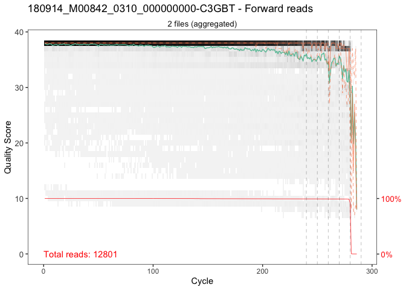
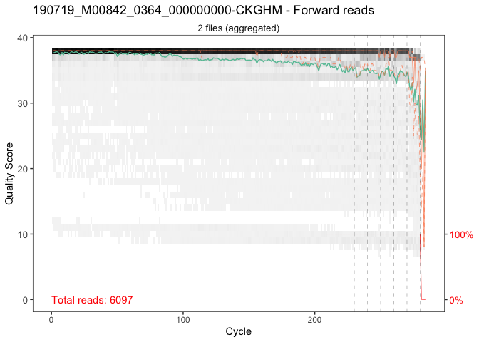
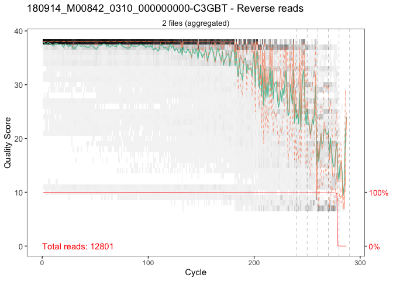
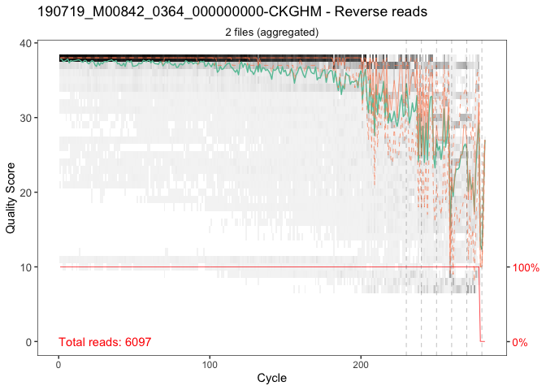
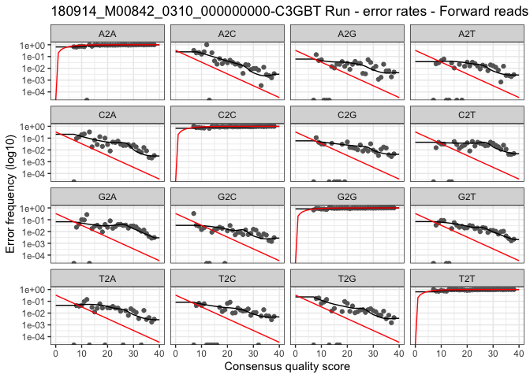
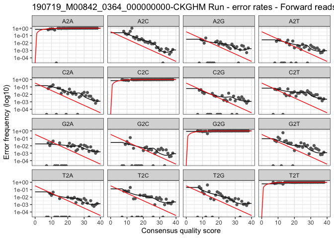
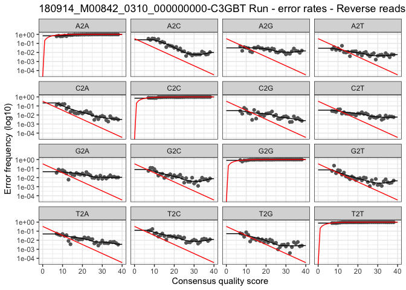
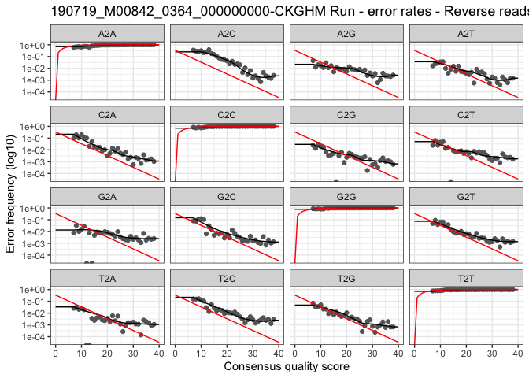
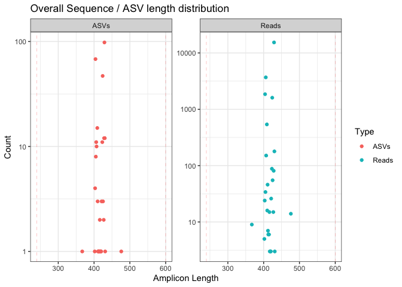

Let's have a look at some test data. Those data are 16S metabarcoding targeting V3V4 region and amplified using fwd CCTAYGGGRBGCASCAG - Rev GGACTACNNGGGTATCTAAT.
As you can see, the test-data/ directory contains an excel file 'metadata.xlsx' as well as two directories. Each of those sub-directories contains Fwd (_R1_) and Rev (_R2_) reads.


```bash
ls -lh  test-data/* 
```

```
## -rw-r--r--  1 fconstan  staff   8.9K Jan 11 13:54 test-data/metadata.xlsx
## 
## test-data/180914_M00842_0310_000000000-C3GBT:
## total 42120
## -rwxr-xr-x  1 fconstan  staff   2.4M Jan 11 13:54 R1F1-S66_L001_R1_001.fastq.gz
## -rwxr-xr-x  1 fconstan  staff   3.5M Jan 11 13:54 R1F1-S66_L001_R2_001.fastq.gz
## -rwxr-xr-x  1 fconstan  staff   2.1M Jan 11 13:54 R1F2-S300_L001_R1_001.fastq.gz
## -rwxr-xr-x  1 fconstan  staff   2.9M Jan 11 13:54 R1F2-S300_L001_R2_001.fastq.gz
## -rwxr-xr-x  1 fconstan  staff   4.1M Jan 11 13:54 R1F3-S90_L001_R1_001.fastq.gz
## -rwxr-xr-x  1 fconstan  staff   5.5M Jan 11 13:54 R1F3-S90_L001_R2_001.fastq.gz
## 
## test-data/190719_M00842_0364_000000000-CKGHM:
## total 36632
## -rw-r--r--  1 fconstan  staff   3.8M Jan 11 13:54 Y2A15-2M-06-S78_L001_R1_001.fastq.gz
## -rw-r--r--  1 fconstan  staff   4.0M Jan 11 13:54 Y2A15-2M-06-S78_L001_R2_001.fastq.gz
## -rw-r--r--  1 fconstan  staff   4.8M Jan 11 13:54 Y2A15-2M-12-S77_L001_R1_001.fastq.gz
## -rw-r--r--  1 fconstan  staff   5.2M Jan 11 13:54 Y2A15-2M-12-S77_L001_R2_001.fastq.gz
## -rw-r--r--  1 fconstan  staff    12K Jan 11 13:54 Y3-R1F4-S136_L001_R1_001.fastq.gz
## -rw-r--r--  1 fconstan  staff    14K Jan 11 13:54 Y3-R1F4-S136_L001_R2_001.fastq.gz
```

# Activate the dedicated conda environment:

Let's start by activating the dedicated conda environment metabarcodingRpipeline we created.

```bash
conda activate metabarcodingRpipeline
```

There are different ways to process the data, the wiser way is to performed the different steps in a step by step approach and wisely validate the results.

# Run the pipeline step by step:

## Check Fwd and Rev reads quality profiles:

The first step is to assess the quality of the reads. This can be done using the run_dada2_qplot.Rscript script.
In order to run that script type Rscript and the path of the script from a terminal. You can access the help of the script by specifying the --help command.
The --fun_dir flag should point to the R file containing the R functions which are going to be used by the Rscript. It comes with the github repo when you clone it or could also point to the online github repo.


```bash
Rscript scripts/run_dada2_qplot.Rscript --help
```

```
## 
## ############################################################
## Starting 
## ############################################################
## 
## Loading required package: optparse
## Usage: scripts/run_dada2_qplot.Rscript [options]
## 
## 
## Options:
## 	-i CHARACTER, --input=CHARACTER
## 		Directory including reads to perform quality plot against - not necessary cut_dir
## 
## 	--file_pattern =CHARACTER
## 		Patterns for R1 and R2
## 
## 	--qplot_dir=CHARACTER
## 		Directory for output
## 
## 	--prop.sample=CHARACTER
## 		 % of samples to run qplot against
## 
## 	--aggregate=CHARACTER
## 		 aggregate quality plots
## 
## 	--sep=CHARACTER
## 		regex pattern to identify sample names  [default: after first _]
## 
## 	--export=CHARACTER
## 		Export pdf, table and intermediate RDS files?
## 
## 	--seed_value=NUMERIC
## 		Seed value for random number generator
## 
## 	-f CHARACTER, --fun_dir=CHARACTER
## 		Directory containing the R functions
## 
## 	-h, --help
## 		Show this help message and exit
## 
## 
## Warning messages:
## 1: In if (is.na(default)) { :
##   the condition has length > 1 and only the first element will be used
## 2: In sub("%default", .as_string(option@default), option@help) :
##   argument 'replacement' has length > 1 and only the first element will be used
```

We would like to perform the quality plots on the raw files which are in the two run specific subdirectories in the test-data directory.
The output will be directed to the following directory: rscript-output/00_dada2_quality_profiles/ By default 20% of the samples for each run will be combined to assess the quality but you could change it by specifying the --prop.sample flag.


```bash
Rscript scripts/run_dada2_qplot.Rscript \
-i test-data \
--qplot_dir rscript-output/00_dada2_quality_profiles/ \
--fun_dir scripts/functions_export_simplified.R 
```

Once the script is terminated, we can inspect the output directory. It contains two pdf files per run.

```bash
ls rscript-output/00_dada2_quality_profiles/* 
```

```
## rscript-output/00_dada2_quality_profiles/180914_M00842_0310_000000000-C3GBT:
## 180914_M00842_0310_000000000-C3GBT_forward.pdf
## 180914_M00842_0310_000000000-C3GBT_reverse.pdf
## 
## rscript-output/00_dada2_quality_profiles/190719_M00842_0364_000000000-CKGHM:
## 190719_M00842_0364_000000000-CKGHM_forward.pdf
## 190719_M00842_0364_000000000-CKGHM_reverse.pdf
```

We can have a look.

```bash
open rscript-output/00_dada2_quality_profiles/180914_M00842_0310_000000000-C3GBT/180914_M00842_0310_000000000-C3GBT_forward.pdf
```


```bash
open rscript-output/00_dada2_quality_profiles/180914_M00842_0310_000000000-C3GBT/180914_M00842_0310_000000000-C3GBT_reverse.pdf
```

## Remove gene specific PCR primers using atropos:

The next step recommanded by dada2 developpers is to remove any non biological sequences. This can be done using atropos (formerly named cutadapt). the input directory is the test-data directory containing run specific sub-directories with Fwd and Rev reads per sample. The primer sequences can be specified using the --fwd_primer and --rev_primer flags. the -T or --threads flag will be specify the number of threads to use by atropos for performing the adapter removal. 

```bash

Rscript scripts/run_atropos.Rscript \
-i test-data/ \
-o rscript-output/01_atropos_primer_removed/ \
--fwd_primer CCTAYGGGRBGCASCAG \
--rev_primer GGACTACNNGGGTATCTAAT \
-T 8 \
-f scripts/functions_export_simplified.R

```

The output directory contains primersout_R1_ and primersout_R2_ fastq.gz files corresponding the the raw fastq files.

```bash

ls -lh rscript-output/01_atropos_primer_removed/*

```

```
## rscript-output/01_atropos_primer_removed/180914_M00842_0310_000000000-C3GBT:
## 
## rscript-output/01_atropos_primer_removed/190719_M00842_0364_000000000-CKGHM:
```

## Filter Fwd and Rev reads (truncate, filter based on maximum Expected Error, ...), merge reads:

The next step is to perform quality filtering of the Fwd and Rev reads using the a priori knowledge (amplicon length and raw paired end read length) as well as the quality profile plots generated earlier. The Fwd and Rev reads will be truncated after the 240 and 230 nucleotides position, respectively. Reads with a maximum expected error >3 and >4 will be discared for Fwd and Rev reads, respectively. Error learning will be performed and read pairs with a minimum of 15 nucleotides overlap will merged. Those steps will be performed on all the sub-directories in the input directory (i.e., all the different runs you want to include in the analysis). 

```bash

Rscript scripts/run_dada2_filter_denoise_merge_reads.Rscript \
--input_dir rscript-output/01_atropos_primer_removed/  \
--output rscript-output/02_dada2_filtered_denoised_merged \
-T 8 --maxee 3,4 --trunclen 240,230 --minover 15 --minLen 180 --remove_input_fastq TRUE \
-f scripts/functions_export_simplified.R

```

Let's have a look at the outputs.


```bash

ls -lh rscript-output/02_dada2_filtered_denoised_merged/*

```

```
## rscript-output/02_dada2_filtered_denoised_merged/180914_M00842_0310_000000000-C3GBT:
## total 264
## -rw-r--r--  1 fconstan  staff    15K Mar 11 13:46 180914_M00842_0310_000000000-C3GBT.RData
## -rw-r--r--  1 fconstan  staff    15K Mar 11 13:46 180914_M00842_0310_000000000-C3GBT_seqtab.rds
## -rw-r--r--  1 fconstan  staff   361B Mar 11 13:46 180914_M00842_0310_000000000-C3GBT_track_analysis.tsv
## -rw-r--r--  1 fconstan  staff    42K Mar 11 13:46 errors_180914_M00842_0310_000000000-C3GBT_fwd.pdf
## -rw-r--r--  1 fconstan  staff    42K Mar 11 13:46 errors_180914_M00842_0310_000000000-C3GBT_rev.pdf
## -rw-r--r--  1 fconstan  staff   7.7K Mar 11 13:46 seq_distrib_180914_M00842_0310_000000000-C3GBT.pdf
## 
## rscript-output/02_dada2_filtered_denoised_merged/190719_M00842_0364_000000000-CKGHM:
## total 280
## -rw-r--r--  1 fconstan  staff    31K Mar 11 13:46 190719_M00842_0364_000000000-CKGHM.RData
## -rw-r--r--  1 fconstan  staff    15K Mar 11 13:46 190719_M00842_0364_000000000-CKGHM_seqtab.rds
## -rw-r--r--  1 fconstan  staff   364B Mar 11 13:46 190719_M00842_0364_000000000-CKGHM_track_analysis.tsv
## -rw-r--r--@ 1 fconstan  staff    32K Mar 11 13:46 errors_190719_M00842_0364_000000000-CKGHM_fwd.pdf
## -rw-r--r--  1 fconstan  staff    42K Mar 11 13:46 errors_190719_M00842_0364_000000000-CKGHM_rev.pdf
## -rw-r--r--@ 1 fconstan  staff   7.7K Mar 11 13:46 seq_distrib_190719_M00842_0364_000000000-CKGHM.pdf
```

We can visualize the error rate distribution.

```bash
open rscript-output/02_dada2_filtered_denoised_merged/190719_M00842_0364_000000000-CKGHM/errors_190719_M00842_0364_000000000-CKGHM_fwd.pdf
```

The length distribution of the reads and ASV.

```bash
open rscript-output/02_dada2_filtered_denoised_merged/190719_M00842_0364_000000000-CKGHM/seq_distrib_190719_M00842_0364_000000000-CKGHM.pdf
```

We can also track the number of reads trough the different steps.

```bash
cat rscript-output/02_dada2_filtered_denoised_merged/190719_M00842_0364_000000000-CKGHM/190719_M00842_0364_000000000-CKGHM_track_analysis.tsv
```

```
## sample	input	filtered	denoisedF	denoisedR	merged	tabled	filtered_pc	denoisedF_pc	denoisedR_pc	merged_pc	filtered_merged_pc	input_merged_pc
## Y2A15-2M-06-S78	7002	6531	6368	6403	6130	6130	0.933	0.975	0.98	0.963	0.939	0.875
## Y2A15-2M-12-S77	6071	5834	5745	5739	5505	5505	0.961	0.985	0.984	0.958	0.944	0.907
## Y3-R1F4-S136	26	18	14	9	8	8	0.692	0.778	0.5	0.571	0.444	0.308
```

## Merge ASV tables from the different run, perform chimera detection:

Since the previous step were run on a run basis, the next step is to combine the results from the different runs. It is also fine to only analyse one run and in this case it should be also placed in on subdirectory of the initial one. The ASV tables will be merged based on the ASV sequences, the chimera will be detected and removed. You might want to perform an additional 100% similarity clustering with the flag --collapseNoMis TRUE. The --trim_length flag indicate the range length of the ASV sequence to be kept.

```bash

Rscript scripts/run_dada2_mergeRuns_removeBimeraDenovo.Rscript \
--filt_dir rscript-output/02_dada2_filtered_denoised_merged/ \
--merged_run_dir rscript-output/03_dada2_merged_runs_chimera_removed \
--trim_length 300,450 \
-T 6 \
-f scripts/functions_export_simplified.R

```

Once again, let's inspect the outputs. Interestingly, one of the output is a phyloseq object: physeq.rds

```bash

ls -lh rscript-output/03_dada2_merged_runs_chimera_removed/*

```

```
## -rw-r--r--  1 fconstan  staff   154K Mar 11 13:49 rscript-output/03_dada2_merged_runs_chimera_removed/no-chim-seqtab.fasta
## -rw-r--r--  1 fconstan  staff    25K Mar 11 13:49 rscript-output/03_dada2_merged_runs_chimera_removed/no-chim-seqtab.rds
## -rw-r--r--  1 fconstan  staff   135K Mar 11 13:49 rscript-output/03_dada2_merged_runs_chimera_removed/physeq.rds
## -rw-r--r--@ 1 fconstan  staff   8.6K Mar 11 13:49 rscript-output/03_dada2_merged_runs_chimera_removed/seqtab_distrib.pdf
## -rw-r--r--  1 fconstan  staff   804B Mar 11 13:49 rscript-output/03_dada2_merged_runs_chimera_removed/track_analysis.tsv
```

We can check the sequence and ASV distribution before length filtering.

```bash
open rscript-output/03_dada2_merged_runs_chimera_removed/seqtab_distrib.pdf
```

Once again, a tsv table summarises the number of reads per samples among the different steps.

```bash
cat rscript-output/03_dada2_merged_runs_chimera_removed/track_analysis.tsv
```

```
## sample	input	filtered	denoisedF	denoisedR	merged	tabled	filtered_pc	denoisedF_pc	denoisedR_pc	merged_pc	filtered_merged_pc	input_merged_pc	tabled_joined	chimera_out	length_filtered	tabled_pc	chimera_out_pc	length_filtered_pc
## R1F1-S66	5613	5389	4941	4897	4277	4277	0.96	0.917	0.909	0.866	0.794	0.762	4277	3598	3598	1	0.84	1
## R1F2-S300	4678	4489	4302	4264	3926	3926	0.96	0.958	0.95	0.913	0.875	0.839	3926	3645	3645	1	0.93	1
## R1F3-S90	8117	7777	7466	7490	6928	6928	0.958	0.96	0.963	0.928	0.891	0.854	6928	5450	5443	1	0.79	1
## Y2A15-2M-06-S78	7002	6531	6368	6403	6130	6130	0.933	0.975	0.98	0.963	0.939	0.875	6130	6098	6088	1	0.99	1
## Y2A15-2M-12-S77	6071	5834	5745	5739	5505	5505	0.961	0.985	0.984	0.958	0.944	0.907	5505	5049	5049	1	0.92	1
## Y3-R1F4-S136	26	18	14	9	8	8	0.692	0.778	0.5	0.571	0.444	0.308	8	8	8	1	1	1
```

The phyloseq object can be imported into R. It is a phyloseq-class experiment-level object containing two objectsL an otu_table() and a refseq() containing the ASV count table and the ASV sequences, respectively.


```r
"rscript-output/03_dada2_merged_runs_chimera_removed/physeq.rds" %>%
  readRDS() -> ps

ps
```

```
## Loading required package: phyloseq
```

## Add the taxonomical assignements to ASV sequences:

Using the information contained in the phyloseq object, we can performed additional steps.


### using dada2 assigntaxa/ assignspecies:


```bash
Rscript scripts/run_phyloseq_dada2_tax.Rscript \
--phyloseq_path rscript-output/03_dada2_merged_runs_chimera_removed/physeq.rds \
--tax_threshold 60 \
--output rscript-output/04_dada2_taxonomy \
--db ~/db/DADA2/silva_nr99_v138_train_set.fa.gz \
--db_species ~/db/DADA2/silva_species_assignment_v138.fa.gz \
--reverse_comp TRUE \
-T 4 \
-f scripts/functions_export_simplified.R
```

The script generate several files including a phyloseq object, which we can load to confirm it now includes a tax_table() information.


```r
"rscript-output/04_dada2_taxonomy/dada2_threshold60_silva_nr99_v138_train_set_physeq.RDS" %>%
  readRDS() -> ps_tax

ps_tax
```

### using DECIPHER IDtaxa::

You can also add or replace taxonomical information of your phyloseq object using DECIPHER IDtaxa function.


```bash
Rscript scripts/run_phyloseq_DECIPHER_tax.Rscript \
--phyloseq_path rscript-output/03_dada2_merged_runs_chimera_removed/physeq.rds \
--export rscript-output/04_dada2_taxonomy \
--reverse_comp TRUE \
--db ~/db/DADA2/SILVA_SSU_r132_March2018.RData \
--tax_threshold 50 \
-T 8 \
-f scripts/functions_export_simplified.R
```


```r
"rscript-output/04_dada2_taxonomy/DECIPHER_threshold_50_SILVA_SSU_r132_March2018_physeq.RDS" %>%
  readRDS() -> ps_tax

ps_tax
```

## Add phylogenetic information:

Since the phyloseq object includes the ASV nucleotide sequences, we can use the script run_add_phylogeny_to_phyloseq.Rscript inorder to perform sequence alignment and phylogenetic tree construction.


```bash
Rscript scripts/run_add_phylogeny_to_phyloseq.Rscript \
--phyloseq_path rscript-output/04_dada2_taxonomy/dada2_threshold60_silva_nr99_v138_train_set_physeq.RDS \
--export rscript-output/05_phylogeny \
-T 4 \
-f scripts/functions_export_simplified.R
```

This generates a phyloseq object which now also contain a phylogenetic tree phy_tree().

```r
"rscript-output/05_phylogeny/phyloseq_phylo.RDS" %>%
  readRDS() -> ps_tax_phylo

ps_tax_phylo
```

## Add metadata:

So far we have been using the scripts whithin the scripts/functions_export_simplified.R file to run Rscripts directly from the terminal. This is of course very usefeull when running jobs on a computational cluster. Alternatively the functions could be directly run from R. For instance, we can use the function physeq_add_metadata in rder to add metadata to a phyloseq object.


```r
"test-data/metadata.xlsx" %>%
  readxl::read_xlsx() -> metatdata

metatdata %>%
  head()
```

```
## # A tibble: 6 x 4
##   sample_name     varA  varB   varC
##   <chr>           <chr> <chr> <dbl>
## 1 R1F1-S66        R     R1      1  
## 2 R1F2-S300       R     R1      0.7
## 3 R1F3-S90        R     R2      1  
## 4 Y2A15-2M-06-S78 Y     R1      1.2
## 5 Y2A15-2M-12-S77 Y     R2      1  
## 6 Y3-R1F4-S136    Y     R2      0.5
```


```r
source("scripts/functions_export_simplified.R")

ps_tax_phylo %>%
  physeq_add_metadata(physeq = .,
                      metadata = "test-data/metadata.xlsx" %>%
  readxl::read_xlsx(),
                      sample_column = "sample_name") -> ps_tax_phylo_meta

ps_tax_phylo_meta
```


# Run the entire pipeline in on command:

One script offers the possibility to run all the commands in on go. 
We are still starting from the same dataset.


```bash
ls -lh  test-data/* 
```

```
## -rw-r--r--  1 fconstan  staff   8.9K Jan 11 13:54 test-data/metadata.xlsx
## 
## test-data/180914_M00842_0310_000000000-C3GBT:
## total 42120
## -rwxr-xr-x  1 fconstan  staff   2.4M Jan 11 13:54 R1F1-S66_L001_R1_001.fastq.gz
## -rwxr-xr-x  1 fconstan  staff   3.5M Jan 11 13:54 R1F1-S66_L001_R2_001.fastq.gz
## -rwxr-xr-x  1 fconstan  staff   2.1M Jan 11 13:54 R1F2-S300_L001_R1_001.fastq.gz
## -rwxr-xr-x  1 fconstan  staff   2.9M Jan 11 13:54 R1F2-S300_L001_R2_001.fastq.gz
## -rwxr-xr-x  1 fconstan  staff   4.1M Jan 11 13:54 R1F3-S90_L001_R1_001.fastq.gz
## -rwxr-xr-x  1 fconstan  staff   5.5M Jan 11 13:54 R1F3-S90_L001_R2_001.fastq.gz
## 
## test-data/190719_M00842_0364_000000000-CKGHM:
## total 36632
## -rw-r--r--  1 fconstan  staff   3.8M Jan 11 13:54 Y2A15-2M-06-S78_L001_R1_001.fastq.gz
## -rw-r--r--  1 fconstan  staff   4.0M Jan 11 13:54 Y2A15-2M-06-S78_L001_R2_001.fastq.gz
## -rw-r--r--  1 fconstan  staff   4.8M Jan 11 13:54 Y2A15-2M-12-S77_L001_R1_001.fastq.gz
## -rw-r--r--  1 fconstan  staff   5.2M Jan 11 13:54 Y2A15-2M-12-S77_L001_R2_001.fastq.gz
## -rw-r--r--  1 fconstan  staff    12K Jan 11 13:54 Y3-R1F4-S136_L001_R1_001.fastq.gz
## -rw-r--r--  1 fconstan  staff    14K Jan 11 13:54 Y3-R1F4-S136_L001_R2_001.fastq.gz
```

The --input (-i) flag specifies the input directory including run specific sub-directories. If you are analyzing one Miseq run, you should then include only one sub-directory. The --preset flag offers the possibility to use predefined parameters for PCR primer removal, filtering parameters .... Since the pylogenetical reconstruction of ASV sequence can take quite some time it is wise to use the default --run_phylo FALSE.By default --export FALSE will not create pdf but the --save_out test_pipe_Rscript.RDS will save all the output into an R object.


```bash

Rscript scripts/dada2_metabarcoding_pipeline.Rscript \
-i test-data/ \
--preset V3V4 \
-T 8 \
--db ~/db/DADA2/silva_nr99_v138_train_set.fa.gz \
--db_species ~/db/DADA2/silva_species_assignment_v138.fa.gz \
--metadata test-data/metadata.xlsx \
--run_phylo FALSE \
--save_out test_pipe_Rscript.RDS \
-f scripts/functions_export_simplified.R

```


```r
"test_pipe_Rscript.RDS" %>%
  readRDS() -> out
```

We can inspect the quality plots of the raw fastq files.


```r
out$qplot
```

```
## $fwd_plot
## $fwd_plot$`180914_M00842_0310_000000000-C3GBT`
```

<!-- -->

```
## 
## $fwd_plot$`190719_M00842_0364_000000000-CKGHM`
```

<!-- -->

```
## 
## 
## $rev_plot
## $rev_plot$`180914_M00842_0310_000000000-C3GBT`
```

<!-- -->

```
## 
## $rev_plot$`190719_M00842_0364_000000000-CKGHM`
```

<!-- -->

We can inspect the error profiles for the Fwd reads


```r
out$filtering_denoising$out_fwd
```

```
## $`180914_M00842_0310_000000000-C3GBT`
```

<!-- -->

```
## 
## $`190719_M00842_0364_000000000-CKGHM`
```

<!-- -->

Similarly, the error profiles for the Rev reads


```r
out$filtering_denoising$out_rev
```

```
## $`180914_M00842_0310_000000000-C3GBT`
```

<!-- -->

```
## 
## $`190719_M00842_0364_000000000-CKGHM`
```

<!-- -->
The (merged) sequence distribution and ASV sequence length distribution can be assessed.


```r
out$merging$plot
```

<!-- -->
The number of reads at the different steps of the pipeline can be also assessed:

```r
out$merging$track %>%
  DT::datatable()
```

```{=html}
<div id="htmlwidget-709639b293ecdffbca30" style="width:100%;height:auto;" class="datatables html-widget"></div>
<script type="application/json" data-for="htmlwidget-709639b293ecdffbca30">{"x":{"filter":"none","data":[["1","2","3","4","5","6"],["R1F1-S66","R1F2-S300","R1F3-S90","Y2A15-2M-06-S78","Y2A15-2M-12-S77","Y3-R1F4-S136"],[5614,4678,8123,7002,6071,26],[5370,4475,7754,6593,5853,20],[4806,4234,7304,6394,5730,13],[4805,4151,7426,6440,5753,9],[4107,3664,6597,6092,5395,8],[4107,3664,6597,6092,5395,8],[0.957,0.957,0.955,0.942,0.964,0.769],[0.895,0.946,0.942,0.97,0.979,0.65],[0.895,0.928,0.958,0.977,0.983,0.45],[0.855,0.865,0.903,0.953,0.942,0.615],[0.765,0.819,0.851,0.924,0.922,0.4],[0.732,0.783,0.812,0.87,0.889,0.308],[4107,3664,6597,6092,5395,8],[3559,3540,5540,6073,5119,8],[3559,3540,5540,6073,5119,8],[1,1,1,1,1,1],[0.87,0.97,0.84,1,0.95,1],[1,1,1,1,1,1]],"container":"<table class=\"display\">\n  <thead>\n    <tr>\n      <th> <\/th>\n      <th>sample<\/th>\n      <th>input<\/th>\n      <th>filtered<\/th>\n      <th>denoisedF<\/th>\n      <th>denoisedR<\/th>\n      <th>merged<\/th>\n      <th>tabled<\/th>\n      <th>filtered_pc<\/th>\n      <th>denoisedF_pc<\/th>\n      <th>denoisedR_pc<\/th>\n      <th>merged_pc<\/th>\n      <th>filtered_merged_pc<\/th>\n      <th>input_merged_pc<\/th>\n      <th>tabled_joined<\/th>\n      <th>chimera_out<\/th>\n      <th>length_filtered<\/th>\n      <th>tabled_pc<\/th>\n      <th>chimera_out_pc<\/th>\n      <th>length_filtered_pc<\/th>\n    <\/tr>\n  <\/thead>\n<\/table>","options":{"columnDefs":[{"className":"dt-right","targets":[2,3,4,5,6,7,8,9,10,11,12,13,14,15,16,17,18,19]},{"orderable":false,"targets":0}],"order":[],"autoWidth":false,"orderClasses":false}},"evals":[],"jsHooks":[]}</script>
```
Finally the phyloseq object is stored in the generated R object.


```r
out$physeq
```

```
## phyloseq-class experiment-level object
## otu_table()   OTU Table:         [ 320 taxa and 6 samples ]
## sample_data() Sample Data:       [ 6 samples by 21 sample variables ]
## tax_table()   Taxonomy Table:    [ 320 taxa by 7 taxonomic ranks ]
## refseq()      DNAStringSet:      [ 320 reference sequences ]
```

# additional features:

Additional features are available.

## Check presence of primers in Fwd and Rev reads / orientation of the reads:


```bash
Rscript scripts/run_check_primers.Rscript \
-i test-data \
--n_samples 1 \
--fwd_primer CCTAYGGGRBGCASCAG \
--rev_primer GGACTACNNGGGTATCTAAT \
-f scripts/functions_export_simplified.R \
--export rscript-output/
```


```bash
cat rscript-output/primers_check.tsv
```

```
## id	Forward	Complement	Reverse	RevComp
## 180914_M00842_0310_000000000-C3GBT.FWD.ForwardReads	2055	915	915	915
## 180914_M00842_0310_000000000-C3GBT.FWD.ReverseReads	943	943	943	1129
## 180914_M00842_0310_000000000-C3GBT.REV.ForwardReads	915	915	915	1950
## 180914_M00842_0310_000000000-C3GBT.REV.ReverseReads	5918	943	943	943
## 190719_M00842_0364_000000000-CKGHM.FWD.ForwardReads	3498	5	5	5
## 190719_M00842_0364_000000000-CKGHM.FWD.ReverseReads	0	0	0	16
## 190719_M00842_0364_000000000-CKGHM.REV.ForwardReads	13	4	5	422
## 190719_M00842_0364_000000000-CKGHM.REV.ReverseReads	3971	0	0	2
```


## vsearch + lulu for post-clustering:


```bash

Rscript scripts/run_phyloseq_vsearch_lulu_cluster_ASV.Rscript \
--phyloseq_path rscript-output/05_phylogeny/phyloseq_phylo.RDS \
--output rscript-output/06_lulu/ \
-T 8 \
--minimum_ratio_type min \
--minimum_relative_cooccurence 0.95 \
--int_rm FALSE \
-f scripts/functions_export_simplified.R
```


```bash
ls -lh rscript-output/06_lulu/
```

```
## total 872
## -rw-r--r--  1 fconstan  staff   126K Mar 11 16:28 lulu_curated_physeq.RDS
## -rw-r--r--  1 fconstan  staff   4.5K Mar 11 16:28 lulu_curated_table.tsv
## -rw-r--r--  1 fconstan  staff    46K Mar 11 16:28 lulu_curated_table.xlsx
## -rw-r--r--  1 fconstan  staff   152K Mar 11 16:28 pre_lulu.fasta
## -rw-r--r--  1 fconstan  staff    59K Mar 11 16:28 pre_lulu_vsearch.list.txt
```


```r
"rscript-output/06_lulu/lulu_curated_physeq.RDS" %>%
  readRDS() -> ps_tax_phylo_lulu

ps_tax_phylo_lulu
```


## pictust2 functional potential esitmation:

tested with **picrust2_pipeline.py 2.3.0-b**


```bash

Rscript scripts/run_phyloseq_picrust2.Rscript \
--phyloseq_path rscript-output/05_phylogeny/phyloseq_phylo.RDS \
--output rscript-output/07_picrust2/ \
--traits EC,KO,PFAM \
--min_reads 100 \
--min_samples 1 \
--add_description TRUE \
--load_picrust2_data TRUE \
--return rscript-output/07_picrust2/ \
-T 8 \
-f scripts/functions_export_simplified.R

```


```bash
ls -lh rscript-output/07_picrust2/
```

```
## total 17888
## drwxr-xr-x  6 fconstan  staff   192B Mar 11 16:58 EC_metagenome_out
## -rw-r--r--  1 fconstan  staff   175K Mar 11 16:47 EC_predicted.tsv.gz
## drwxr-xr-x  6 fconstan  staff   192B Mar 11 16:58 KO_metagenome_out
## -rw-r--r--  1 fconstan  staff   412K Mar 11 16:52 KO_predicted.tsv.gz
## drwxr-xr-x  6 fconstan  staff   192B Mar 11 16:58 PFAM_metagenome_out
## -rw-r--r--  1 fconstan  staff   662K Mar 11 16:58 PFAM_predicted.tsv.gz
## -rw-r--r--  1 fconstan  staff   2.4K Mar 11 16:46 marker_predicted_and_nsti.tsv.gz
## -rw-r--r--  1 fconstan  staff   633K Mar 11 16:46 out.tre
## drwxr-xr-x  6 fconstan  staff   192B Mar 11 17:01 pathways_out
## -rw-r--r--  1 fconstan  staff   6.1M Mar 11 17:02 picrust2_R.rds
```


```r
"rscript-output/07_picrust2/picrust2_R.rds" %>%
  readRDS() -> picrust2_data

picrust2_data %>%
  str()
```

```
## List of 10
##  $ EC_metagenome_out_pred_metagenome_contrib  : spec_tbl_df [236,227 × 8] (S3: spec_tbl_df/tbl_df/tbl/data.frame)
##   ..$ sample                 : chr [1:236227] "R1F1-S66" "R1F1-S66" "R1F1-S66" "R1F1-S66" ...
##   ..$ function               : chr [1:236227] "EC:1.1.1.1" "EC:1.1.1.1" "EC:1.1.1.1" "EC:1.1.1.1" ...
##   ..$ taxon                  : chr [1:236227] "ASV001" "ASV003" "ASV012" "ASV019" ...
##   ..$ taxon_abun             : num [1:236227] 749 183 6 10 47 ...
##   ..$ taxon_rel_abun         : num [1:236227] 52.44 12.84 0.42 0.7 3.29 ...
##   ..$ genome_function_count  : num [1:236227] 3 4 3 4 7 130 7 10 7 6 ...
##   ..$ taxon_function_abun    : num [1:236227] 2246 733 18 40 329 ...
##   ..$ taxon_rel_function_abun: num [1:236227] 157.33 51.34 1.26 2.8 23.05 ...
##   ..- attr(*, "spec")=
##   .. .. cols(
##   .. ..   sample = col_character(),
##   .. ..   `function` = col_character(),
##   .. ..   taxon = col_character(),
##   .. ..   taxon_abun = col_double(),
##   .. ..   taxon_rel_abun = col_double(),
##   .. ..   genome_function_count = col_double(),
##   .. ..   taxon_function_abun = col_double(),
##   .. ..   taxon_rel_function_abun = col_double()
##   .. .. )
##  $ EC_metagenome_out_pred_metagenome_unstrat  : spec_tbl_df [2,030 × 8] (S3: spec_tbl_df/tbl_df/tbl/data.frame)
##   ..$ function       : chr [1:2030] "EC:1.1.1.1" "EC:1.1.1.100" "EC:1.1.1.103" "EC:1.1.1.105" ...
##   ..$ description    : chr [1:2030] "Alcohol dehydrogenase" "3-oxoacyl-[acyl-carrier-protein] reductase" "L-threonine 3-dehydrogenase" "All-trans-retinol dehydrogenase (NAD(+))" ...
##   ..$ R1F1-S66       : num [1:2030] 4529 10332 422 0 322 ...
##   ..$ R1F2-S300      : num [1:2030] 4717 10343 405 0 314 ...
##   ..$ R1F3-S90       : num [1:2030] 9050 18392 152 0 534 ...
##   ..$ Y2A15-2M-06-S78: num [1:2030] 9206 13770 289 7 138 ...
##   ..$ Y2A15-2M-12-S77: num [1:2030] 7432 12867 692 0 255 ...
##   ..$ Y3-R1F4-S136   : num [1:2030] 12.3 24.9 6 0 0 ...
##   ..- attr(*, "spec")=
##   .. .. cols(
##   .. ..   `function` = col_character(),
##   .. ..   description = col_character(),
##   .. ..   `R1F1-S66` = col_double(),
##   .. ..   `R1F2-S300` = col_double(),
##   .. ..   `R1F3-S90` = col_double(),
##   .. ..   `Y2A15-2M-06-S78` = col_double(),
##   .. ..   `Y2A15-2M-12-S77` = col_double(),
##   .. ..   `Y3-R1F4-S136` = col_double()
##   .. .. )
##  $ KO_metagenome_out_pred_metagenome_contrib  : spec_tbl_df [516,413 × 8] (S3: spec_tbl_df/tbl_df/tbl/data.frame)
##   ..$ sample                 : chr [1:516413] "R1F1-S66" "R1F1-S66" "R1F1-S66" "R1F1-S66" ...
##   ..$ function               : chr [1:516413] "K00001" "K00001" "K00001" "K00001" ...
##   ..$ taxon                  : chr [1:516413] "ASV001" "ASV003" "ASV012" "ASV019" ...
##   ..$ taxon_abun             : num [1:516413] 749 183 6 10 47 ...
##   ..$ taxon_rel_abun         : num [1:516413] 52.44 12.84 0.42 0.7 3.29 ...
##   ..$ genome_function_count  : num [1:516413] 1 1 1 1 3 28 1 1 1 1 ...
##   ..$ taxon_function_abun    : num [1:516413] 749 183 6 10 141 ...
##   ..$ taxon_rel_function_abun: num [1:516413] 52.44 12.84 0.42 0.7 9.88 ...
##   ..- attr(*, "spec")=
##   .. .. cols(
##   .. ..   sample = col_character(),
##   .. ..   `function` = col_character(),
##   .. ..   taxon = col_character(),
##   .. ..   taxon_abun = col_double(),
##   .. ..   taxon_rel_abun = col_double(),
##   .. ..   genome_function_count = col_double(),
##   .. ..   taxon_function_abun = col_double(),
##   .. ..   taxon_rel_function_abun = col_double()
##   .. .. )
##  $ KO_metagenome_out_pred_metagenome_unstrat  : spec_tbl_df [6,490 × 8] (S3: spec_tbl_df/tbl_df/tbl/data.frame)
##   ..$ function       : chr [1:6490] "K00001" "K00003" "K00004" "K00005" ...
##   ..$ description    : chr [1:6490] "E1.1.1.1, adh; alcohol dehydrogenase [EC:1.1.1.1]" "E1.1.1.3; homoserine dehydrogenase [EC:1.1.1.3]" "BDH, butB; (R,R)-butanediol dehydrogenase / meso-butanediol dehydrogenase / diacetyl reductase [EC:1.1.1.4 1.1.1.- 1.1.1.303]" "gldA; glycerol dehydrogenase [EC:1.1.1.6]" ...
##   ..$ R1F1-S66       : num [1:6490] 1352.2 1399.3 318 22.2 249.2 ...
##   ..$ R1F2-S300      : num [1:6490] 1436.2 1477.3 321.5 69.1 247 ...
##   ..$ R1F3-S90       : num [1:6490] 1454 4224 694 156 37 ...
##   ..$ Y2A15-2M-06-S78: num [1:6490] 690 4716 358 3576 260 ...
##   ..$ Y2A15-2M-12-S77: num [1:6490] 1699 2609 718 941 446 ...
##   ..$ Y3-R1F4-S136   : num [1:6490] 6.17 6.17 12 0 0 ...
##   ..- attr(*, "spec")=
##   .. .. cols(
##   .. ..   `function` = col_character(),
##   .. ..   description = col_character(),
##   .. ..   `R1F1-S66` = col_double(),
##   .. ..   `R1F2-S300` = col_double(),
##   .. ..   `R1F3-S90` = col_double(),
##   .. ..   `Y2A15-2M-06-S78` = col_double(),
##   .. ..   `Y2A15-2M-12-S77` = col_double(),
##   .. ..   `Y3-R1F4-S136` = col_double()
##   .. .. )
##  $ marker_predicted_and_nsti                  : spec_tbl_df [362 × 3] (S3: spec_tbl_df/tbl_df/tbl/data.frame)
##   ..$ sequence      : chr [1:362] "ASV001" "ASV002" "ASV003" "ASV004" ...
##   ..$ 16S_rRNA_Count: num [1:362] 3 1 4 1 6 1 10 1 3 1 ...
##   ..$ metadata_NSTI : num [1:362] 0.0115 0.0316 0.0111 0.0934 0.0329 ...
##   ..- attr(*, "spec")=
##   .. .. cols(
##   .. ..   sequence = col_character(),
##   .. ..   `16S_rRNA_Count` = col_double(),
##   .. ..   metadata_NSTI = col_double()
##   .. .. )
##  $ pathways_out_path_abun_contrib             : spec_tbl_df [50,597 × 8] (S3: spec_tbl_df/tbl_df/tbl/data.frame)
##   ..$ sample                 : chr [1:50597] "R1F1-S66" "R1F1-S66" "R1F1-S66" "R1F1-S66" ...
##   ..$ function               : chr [1:50597] "1CMET2-PWY" "1CMET2-PWY" "1CMET2-PWY" "1CMET2-PWY" ...
##   ..$ taxon                  : chr [1:50597] "ASV001" "ASV003" "ASV012" "ASV018" ...
##   ..$ taxon_abun             : num [1:50597] 748.67 183.25 6 6.33 10 ...
##   ..$ taxon_rel_abun         : num [1:50597] 52.442 12.836 0.42 0.443 0.7 ...
##   ..$ genome_function_count  : num [1:50597] 1.08 1.45 1.17 1 1 ...
##   ..$ taxon_function_abun    : num [1:50597] 806.24 265.4 7 6.33 10 ...
##   ..$ taxon_rel_function_abun: num [1:50597] 56.475 18.59 0.49 0.443 0.7 ...
##   ..- attr(*, "spec")=
##   .. .. cols(
##   .. ..   sample = col_character(),
##   .. ..   `function` = col_character(),
##   .. ..   taxon = col_character(),
##   .. ..   taxon_abun = col_double(),
##   .. ..   taxon_rel_abun = col_double(),
##   .. ..   genome_function_count = col_double(),
##   .. ..   taxon_function_abun = col_double(),
##   .. ..   taxon_rel_function_abun = col_double()
##   .. .. )
##  $ pathways_out_path_abun_unstrat_per_seq     : spec_tbl_df [347 × 7] (S3: spec_tbl_df/tbl_df/tbl/data.frame)
##   ..$ pathway        : chr [1:347] "1CMET2-PWY" "3-HYDROXYPHENYLACETATE-DEGRADATION-PWY" "AEROBACTINSYN-PWY" "ALL-CHORISMATE-PWY" ...
##   ..$ R1F1-S66       : num [1:347] 1562 1457 0 0 1015 ...
##   ..$ R1F2-S300      : num [1:347] 1543.2 1449.2 2 6.4 1070.2 ...
##   ..$ R1F3-S90       : num [1:347] 4143 27.6 0 11.9 2731.5 ...
##   ..$ Y2A15-2M-06-S78: num [1:347] 2100.92 131.32 0 7.65 924.78 ...
##   ..$ Y2A15-2M-12-S77: num [1:347] 2671.3 97 13 14.6 1606.1 ...
##   ..$ Y3-R1F4-S136   : num [1:347] 6.17 0 0 0 0 ...
##   ..- attr(*, "spec")=
##   .. .. cols(
##   .. ..   pathway = col_character(),
##   .. ..   `R1F1-S66` = col_double(),
##   .. ..   `R1F2-S300` = col_double(),
##   .. ..   `R1F3-S90` = col_double(),
##   .. ..   `Y2A15-2M-06-S78` = col_double(),
##   .. ..   `Y2A15-2M-12-S77` = col_double(),
##   .. ..   `Y3-R1F4-S136` = col_double()
##   .. .. )
##  $ pathways_out_path_abun_unstrat             : spec_tbl_df [392 × 8] (S3: spec_tbl_df/tbl_df/tbl/data.frame)
##   ..$ pathway        : chr [1:392] "1CMET2-PWY" "3-HYDROXYPHENYLACETATE-DEGRADATION-PWY" "AEROBACTINSYN-PWY" "ALL-CHORISMATE-PWY" ...
##   ..$ description    : chr [1:392] "N10-formyl-tetrahydrofolate biosynthesis" "4-hydroxyphenylacetate degradation" "aerobactin biosynthesis" "superpathway of chorismate metabolism" ...
##   ..$ R1F1-S66       : num [1:392] 1657 1519 0 151 1657 ...
##   ..$ R1F2-S300      : num [1:392] 1698.21 1525.99 3.54 273.72 1745.38 ...
##   ..$ R1F3-S90       : num [1:392] 4378.8 37.1 0 348.9 4433 ...
##   ..$ Y2A15-2M-06-S78: num [1:392] 3872 160 0 2054 4441 ...
##   ..$ Y2A15-2M-12-S77: num [1:392] 3043.6 135 18.1 1521.3 3280.2 ...
##   ..$ Y3-R1F4-S136   : num [1:392] 6.145 0 0 0 0.983 ...
##   ..- attr(*, "spec")=
##   .. .. cols(
##   .. ..   pathway = col_character(),
##   .. ..   description = col_character(),
##   .. ..   `R1F1-S66` = col_double(),
##   .. ..   `R1F2-S300` = col_double(),
##   .. ..   `R1F3-S90` = col_double(),
##   .. ..   `Y2A15-2M-06-S78` = col_double(),
##   .. ..   `Y2A15-2M-12-S77` = col_double(),
##   .. ..   `Y3-R1F4-S136` = col_double()
##   .. .. )
##  $ PFAM_metagenome_out_pred_metagenome_contrib: spec_tbl_df [697,357 × 8] (S3: spec_tbl_df/tbl_df/tbl/data.frame)
##   ..$ sample                 : chr [1:697357] "R1F1-S66" "R1F1-S66" "R1F1-S66" "R1F1-S66" ...
##   ..$ function               : chr [1:697357] "PF00004" "PF00004" "PF00004" "PF00004" ...
##   ..$ taxon                  : chr [1:697357] "ASV001" "ASV003" "ASV012" "ASV019" ...
##   ..$ taxon_abun             : num [1:697357] 749 183 6 10 47 ...
##   ..$ taxon_rel_abun         : num [1:697357] 52.44 12.84 0.42 0.7 3.29 ...
##   ..$ genome_function_count  : num [1:697357] 10 10 9 8 10 476 10 10 10 10 ...
##   ..$ taxon_function_abun    : num [1:697357] 7487 1832 54 80 470 ...
##   ..$ taxon_rel_function_abun: num [1:697357] 524.42 128.36 3.78 5.6 32.92 ...
##   ..- attr(*, "spec")=
##   .. .. cols(
##   .. ..   sample = col_character(),
##   .. ..   `function` = col_character(),
##   .. ..   taxon = col_character(),
##   .. ..   taxon_abun = col_double(),
##   .. ..   taxon_rel_abun = col_double(),
##   .. ..   genome_function_count = col_double(),
##   .. ..   taxon_function_abun = col_double(),
##   .. ..   taxon_rel_function_abun = col_double()
##   .. .. )
##  $ PFAM_metagenome_out_pred_metagenome_unstrat: spec_tbl_df [7,470 × 8] (S3: spec_tbl_df/tbl_df/tbl/data.frame)
##   ..$ function       : chr [1:7470] "PF00004" "PF00005" "PF00006" "PF00009" ...
##   ..$ description    : chr [1:7470] "ATPase family associated with various cellular activities (AAA)" "ABC transporter" "ATP synthase alpha/beta family, nucleotide-binding domain" "Elongation factor Tu GTP binding domain" ...
##   ..$ R1F1-S66       : num [1:7470] 13615 14276 5991 12524 5112 ...
##   ..$ R1F2-S300      : num [1:7470] 14102 15054 6249 12981 5234 ...
##   ..$ R1F3-S90       : num [1:7470] 40552 43024 19376 36707 8545 ...
##   ..$ Y2A15-2M-06-S78: num [1:7470] 43718 52159 14293 35133 4837 ...
##   ..$ Y2A15-2M-12-S77: num [1:7470] 25532 31048 13165 24997 4660 ...
##   ..$ Y3-R1F4-S136   : num [1:7470] 31.7 61.7 24.9 37.5 12.3 ...
##   ..- attr(*, "spec")=
##   .. .. cols(
##   .. ..   `function` = col_character(),
##   .. ..   description = col_character(),
##   .. ..   `R1F1-S66` = col_double(),
##   .. ..   `R1F2-S300` = col_double(),
##   .. ..   `R1F3-S90` = col_double(),
##   .. ..   `Y2A15-2M-06-S78` = col_double(),
##   .. ..   `Y2A15-2M-12-S77` = col_double(),
##   .. ..   `Y3-R1F4-S136` = col_double()
##   .. .. )
```


```r
sessionInfo()
```

```
## R version 4.0.4 (2021-02-15)
## Platform: x86_64-apple-darwin17.0 (64-bit)
## Running under: macOS Mojave 10.14.6
## 
## Matrix products: default
## BLAS:   /Library/Frameworks/R.framework/Versions/4.0/Resources/lib/libRblas.dylib
## LAPACK: /Library/Frameworks/R.framework/Versions/4.0/Resources/lib/libRlapack.dylib
## 
## locale:
## [1] en_US.UTF-8/en_US.UTF-8/en_US.UTF-8/C/en_US.UTF-8/en_US.UTF-8
## 
## attached base packages:
## [1] stats     graphics  grDevices utils     datasets  methods   base     
## 
## other attached packages:
##  [1] phyloseq_1.34.0      forcats_0.5.1        stringr_1.4.0       
##  [4] dplyr_1.0.4          purrr_0.3.4          readr_1.4.0         
##  [7] tidyr_1.1.2          tibble_3.1.0         ggplot2_3.3.3       
## [10] tidyverse_1.3.0.9000
## 
## loaded via a namespace (and not attached):
##   [1] colorspace_2.0-0            hwriter_1.3.2              
##   [3] ellipsis_0.3.1              XVector_0.30.0             
##   [5] GenomicRanges_1.42.0        fs_1.5.0                   
##   [7] rstudioapi_0.13             farver_2.1.0               
##   [9] DT_0.17                     fansi_0.4.2                
##  [11] lubridate_1.7.10            xml2_1.3.2                 
##  [13] codetools_0.2-18            splines_4.0.4              
##  [15] knitr_1.31                  dada2_1.16.0               
##  [17] ade4_1.7-16                 jsonlite_1.7.2             
##  [19] Rsamtools_2.4.0             broom_0.7.5                
##  [21] cluster_2.1.1               dbplyr_2.1.0               
##  [23] png_0.1-7                   compiler_4.0.4             
##  [25] httr_1.4.2                  backports_1.2.1            
##  [27] assertthat_0.2.1            Matrix_1.3-2               
##  [29] cli_2.3.1                   htmltools_0.5.1.1          
##  [31] prettyunits_1.1.1           tools_4.0.4                
##  [33] igraph_1.2.6                gtable_0.3.0               
##  [35] glue_1.4.2                  GenomeInfoDbData_1.2.4     
##  [37] reshape2_1.4.4              ShortRead_1.46.0           
##  [39] Rcpp_1.0.6                  Biobase_2.50.0             
##  [41] cellranger_1.1.0            jquerylib_0.1.3            
##  [43] vctrs_0.3.6                 Biostrings_2.58.0          
##  [45] rhdf5filters_1.2.0          multtest_2.46.0            
##  [47] ape_5.4-1                   nlme_3.1-152               
##  [49] iterators_1.0.13            crosstalk_1.1.1            
##  [51] xfun_0.21                   rvest_0.3.6                
##  [53] lifecycle_1.0.0             zlibbioc_1.36.0            
##  [55] MASS_7.3-53.1               scales_1.1.1               
##  [57] hms_1.0.0                   MatrixGenerics_1.2.0       
##  [59] parallel_4.0.4              SummarizedExperiment_1.20.0
##  [61] biomformat_1.18.0           rhdf5_2.34.0               
##  [63] RColorBrewer_1.1-2          yaml_2.2.1                 
##  [65] sass_0.3.1                  latticeExtra_0.6-29        
##  [67] stringi_1.5.3               highr_0.8                  
##  [69] S4Vectors_0.28.1            foreach_1.5.1              
##  [71] permute_0.9-5               BiocGenerics_0.36.0        
##  [73] BiocParallel_1.24.1         GenomeInfoDb_1.26.2        
##  [75] matrixStats_0.58.0          rlang_0.4.10               
##  [77] pkgconfig_2.0.3             bitops_1.0-6               
##  [79] evaluate_0.14               lattice_0.20-41            
##  [81] Rhdf5lib_1.12.0             labeling_0.4.2             
##  [83] GenomicAlignments_1.24.0    htmlwidgets_1.5.3          
##  [85] tidyselect_1.1.0            plyr_1.8.6                 
##  [87] magrittr_2.0.1              R6_2.5.0                   
##  [89] IRanges_2.24.1              generics_0.1.0             
##  [91] DelayedArray_0.16.1         DBI_1.1.1                  
##  [93] pillar_1.5.0                haven_2.3.1                
##  [95] withr_2.4.1                 mgcv_1.8-34                
##  [97] survival_3.2-7              RCurl_1.98-1.2             
##  [99] modelr_0.1.8                crayon_1.4.1               
## [101] utf8_1.1.4                  rmarkdown_2.7              
## [103] jpeg_0.1-8.1                progress_1.2.2             
## [105] grid_4.0.4                  readxl_1.3.1               
## [107] data.table_1.14.0           vegan_2.5-7                
## [109] reprex_1.0.0                digest_0.6.27              
## [111] RcppParallel_5.0.3          stats4_4.0.4               
## [113] munsell_0.5.0               bslib_0.2.4
```

